# MELLEA


**metamodel version:** 1.11.0

**version:** 2026-05-26


LinkML schema describing the Mellea codebase architecture and public data models. Generated from Python sources by linkml/scripts/schema_to_linkml.py.


## Class Diagram

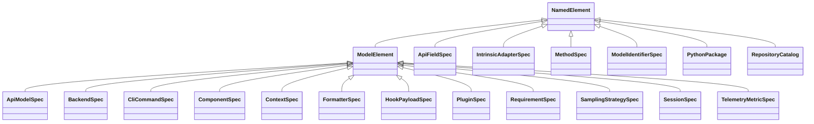

## ERD Diagrams


### Component 1 (ApiFieldSpec, ApiModelSpec, CliCommandSpec)

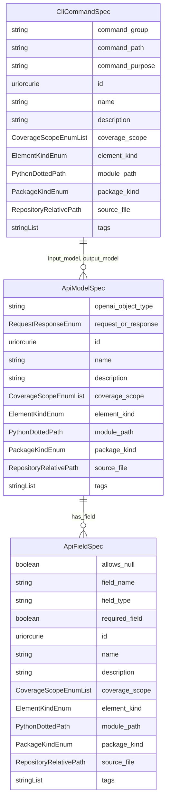

### Component 2 (BackendSpec, ContextSpec, FormatterSpec...)

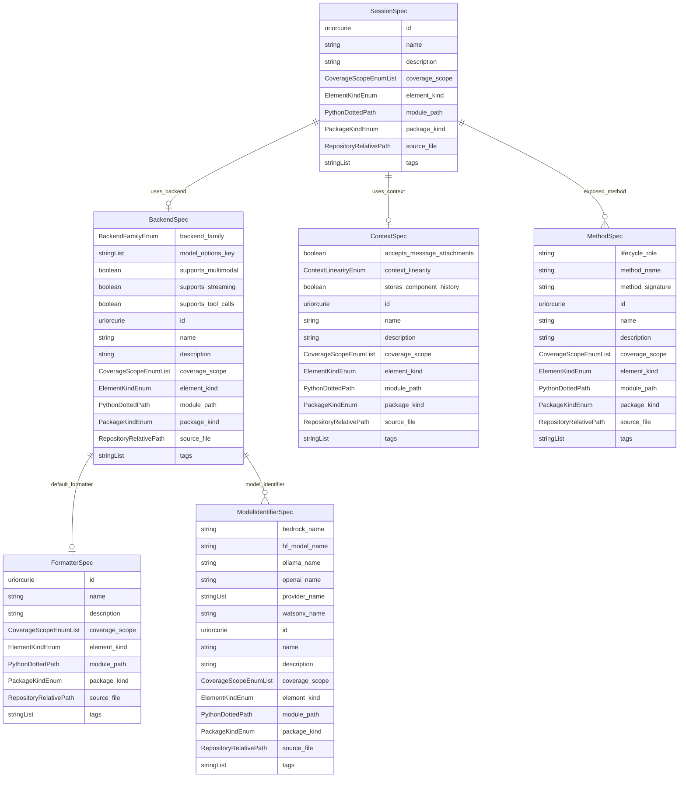

### Component 3 (HookPayloadSpec, PluginSpec)

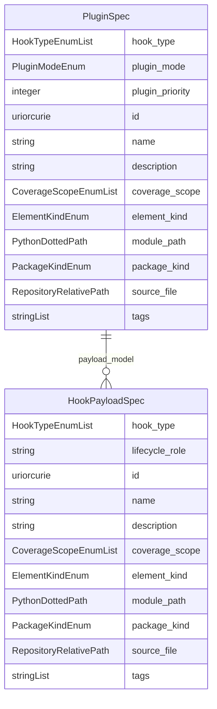

## Base Classes


Foundational classes in the hierarchy (root classes and direct children of Thing):

| Class | Description |
| --- | --- |
| [NamedElement](#NamedElement) | Abstract base for any named, identifiable schema element. |

## Standalone Classes


These classes are completely isolated with no relationships and are not used as base classes:

| Class | Description |
| --- | --- |
| [ComponentSpec](#ComponentSpec) | Specification of a Mellea stdlib component type. |
| [IntrinsicAdapterSpec](#IntrinsicAdapterSpec) | Specification of an intrinsic adapter (LoRA / aLoRA). |
| [PythonPackage](#PythonPackage) | A logical Python package (directory) inside the repository. |
| [RepositoryCatalog](#RepositoryCatalog) | Top-level catalog rooting the analysed repository snapshot. |
| [RequirementSpec](#RequirementSpec) | Specification of a requirement validator. |
| [SamplingStrategySpec](#SamplingStrategySpec) | Specification of a sampling-loop strategy. |
| [TelemetryMetricSpec](#TelemetryMetricSpec) | Specification of a telemetry metric emitted by Mellea. |

## Abstract Classes


### ModelElement

Abstract base for concrete architectural elements.

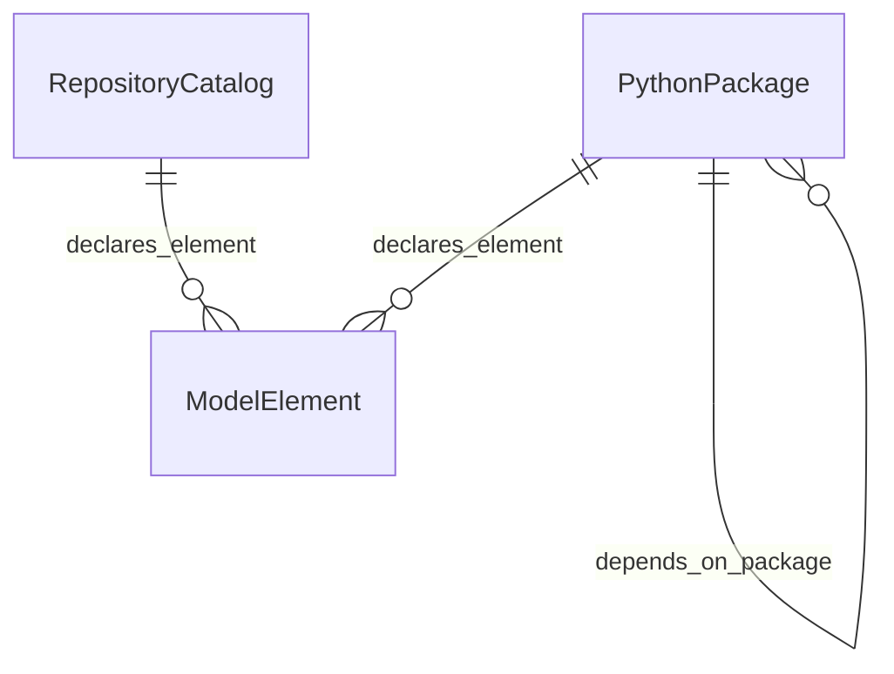

#### Attributes

| Name | Cardinality: | Type | Description |
| --- | --- | --- | --- |
| **[id](#Id)** | <sub>1..1</sub> | uriorcurie | Stable identifier for a schema element. |
| **[name](#Name)** | <sub>1..1</sub> | string | Human-readable name. |
| **[description](#Description)** | <sub>0..1</sub> | string | Narrative description of the element. |
| **[coverage_scope](#CoverageScope)** | <sub>0..\*</sub> | [CoverageScopeEnum](#CoverageScopeEnum) | Where this element surfaces (source/API/CLI/example/test). |
| **[element_kind](#ElementKind)** | <sub>0..1</sub> | [ElementKindEnum](#ElementKindEnum) | Kind of Python declaration. |
| **[module_path](#ModulePath)** | <sub>0..1</sub> | PythonDottedPath | Python module path where this element is defined. |
| **[package_kind](#PackageKind)** | <sub>0..1</sub> | [PackageKindEnum](#PackageKindEnum) | Package bucket. |
| **[source_file](#SourceFile)** | <sub>0..1</sub> | RepositoryRelativePath | Source file relative to repository root. |
| **[tags](#Tags)** | <sub>0..\*</sub> | string | Free-form classification tags. |

#### Parents

 * [NamedElement](#NamedElement) - Abstract base for any named, identifiable schema element.

#### Children

 * [ApiModelSpec](#ApiModelSpec) - Specification of an HTTP API wire model.
 * [BackendSpec](#BackendSpec) - Specification of a Mellea backend implementation.
 * [CliCommandSpec](#CliCommandSpec) - Specification of a CLI command exposed under `m`.
 * [ComponentSpec](#ComponentSpec) - Specification of a Mellea stdlib component type.
 * [ContextSpec](#ContextSpec) - Specification of a context implementation.
 * [FormatterSpec](#FormatterSpec) - Specification of an output formatter for a backend.
 * [HookPayloadSpec](#HookPayloadSpec) - Specification of a hook payload model.
 * [PluginSpec](#PluginSpec) - Specification of a Mellea plugin and the hooks it registers.
 * [RequirementSpec](#RequirementSpec) - Specification of a requirement validator.
 * [SamplingStrategySpec](#SamplingStrategySpec) - Specification of a sampling-loop strategy.
 * [SessionSpec](#SessionSpec) - Specification of a Mellea session.
 * [TelemetryMetricSpec](#TelemetryMetricSpec) - Specification of a telemetry metric emitted by Mellea.

#### Referenced by:

 *  **[PythonPackage](#PythonPackage)** : declares_element  <sub>0..\*</sub> 
 *  **[RepositoryCatalog](#RepositoryCatalog)** : declares_element  <sub>0..\*</sub> 


### NamedElement

Abstract base for any named, identifiable schema element.


#### Local class diagram

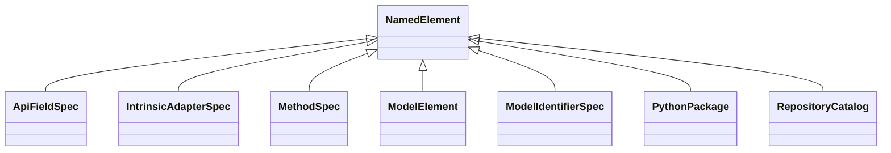

#### Attributes

| Name | Cardinality: | Type | Description |
| --- | --- | --- | --- |
| **[id](#Id)** | <sub>1..1</sub> | uriorcurie | Stable identifier for a schema element. |
| **[name](#Name)** | <sub>1..1</sub> | string | Human-readable name. |
| **[description](#Description)** | <sub>0..1</sub> | string | Narrative description of the element. |
| **[coverage_scope](#CoverageScope)** | <sub>0..\*</sub> | [CoverageScopeEnum](#CoverageScopeEnum) | Where this element surfaces (source/API/CLI/example/test). |
| **[element_kind](#ElementKind)** | <sub>0..1</sub> | [ElementKindEnum](#ElementKindEnum) | Kind of Python declaration. |
| **[module_path](#ModulePath)** | <sub>0..1</sub> | PythonDottedPath | Python module path where this element is defined. |
| **[package_kind](#PackageKind)** | <sub>0..1</sub> | [PackageKindEnum](#PackageKindEnum) | Package bucket. |
| **[source_file](#SourceFile)** | <sub>0..1</sub> | RepositoryRelativePath | Source file relative to repository root. |
| **[tags](#Tags)** | <sub>0..\*</sub> | string | Free-form classification tags. |

#### Children

 * [ApiFieldSpec](#ApiFieldSpec) - Specification of a single field in an API model.
 * [IntrinsicAdapterSpec](#IntrinsicAdapterSpec) - Specification of an intrinsic adapter (LoRA / aLoRA).
 * [MethodSpec](#MethodSpec) - Specification of a method exposed by a runtime class.
 * [ModelElement](#ModelElement) - Abstract base for concrete architectural elements.
 * [ModelIdentifierSpec](#ModelIdentifierSpec) - Cross-provider identifier table for a single model.
 * [PythonPackage](#PythonPackage) - A logical Python package (directory) inside the repository.
 * [RepositoryCatalog](#RepositoryCatalog) - Top-level catalog rooting the analysed repository snapshot.


## Classes


### ApiFieldSpec

Specification of a single field in an API model.

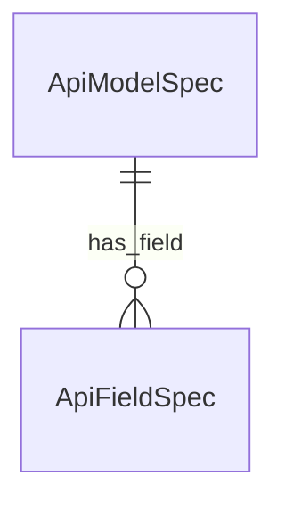

#### Attributes

| Name | Cardinality: | Type | Description |
| --- | --- | --- | --- |
| **[id](#Id)** | <sub>1..1</sub> | uriorcurie | Stable identifier for a schema element. |
| **[name](#Name)** | <sub>1..1</sub> | string | Human-readable name. |
| **[description](#Description)** | <sub>0..1</sub> | string | Narrative description of the element. |
| **[coverage_scope](#CoverageScope)** | <sub>0..\*</sub> | [CoverageScopeEnum](#CoverageScopeEnum) | Where this element surfaces (source/API/CLI/example/test). |
| **[element_kind](#ElementKind)** | <sub>0..1</sub> | [ElementKindEnum](#ElementKindEnum) | Kind of Python declaration. |
| **[module_path](#ModulePath)** | <sub>0..1</sub> | PythonDottedPath | Python module path where this element is defined. |
| **[package_kind](#PackageKind)** | <sub>0..1</sub> | [PackageKindEnum](#PackageKindEnum) | Package bucket. |
| **[source_file](#SourceFile)** | <sub>0..1</sub> | RepositoryRelativePath | Source file relative to repository root. |
| **[tags](#Tags)** | <sub>0..\*</sub> | string | Free-form classification tags. |
| **[allows_null](#AllowsNull)** | <sub>0..1</sub> | boolean | Slot describing the allows null. |
| **[field_name](#FieldName)** | <sub>0..1</sub> | string | Slot describing the field name. |
| **[field_type](#FieldType)** | <sub>0..1</sub> | string | Slot describing the field type. |
| **[required_field](#RequiredField)** | <sub>0..1</sub> | boolean | Slot describing the required field. |

#### Parents

 * [NamedElement](#NamedElement) - Abstract base for any named, identifiable schema element.

#### Referenced by:

 *  **[ApiModelSpec](#ApiModelSpec)** : has_field  <sub>0..\*</sub> 


### ApiModelSpec

Specification of an HTTP API wire model.

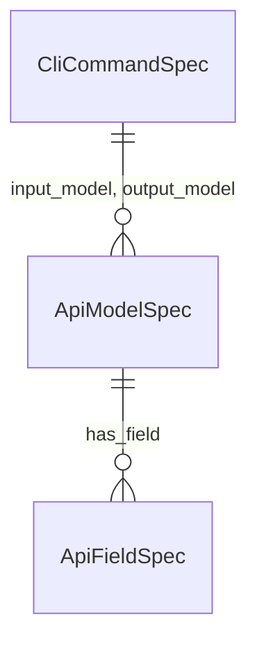

#### Attributes

| Name | Cardinality: | Type | Description |
| --- | --- | --- | --- |
| **[id](#Id)** | <sub>1..1</sub> | uriorcurie | Stable identifier for a schema element. |
| **[name](#Name)** | <sub>1..1</sub> | string | Human-readable name. |
| **[description](#Description)** | <sub>0..1</sub> | string | Narrative description of the element. |
| **[coverage_scope](#CoverageScope)** | <sub>0..\*</sub> | [CoverageScopeEnum](#CoverageScopeEnum) | Where this element surfaces (source/API/CLI/example/test). |
| **[element_kind](#ElementKind)** | <sub>0..1</sub> | [ElementKindEnum](#ElementKindEnum) | Kind of Python declaration. |
| **[module_path](#ModulePath)** | <sub>0..1</sub> | PythonDottedPath | Python module path where this element is defined. |
| **[package_kind](#PackageKind)** | <sub>0..1</sub> | [PackageKindEnum](#PackageKindEnum) | Package bucket. |
| **[source_file](#SourceFile)** | <sub>0..1</sub> | RepositoryRelativePath | Source file relative to repository root. |
| **[tags](#Tags)** | <sub>0..\*</sub> | string | Free-form classification tags. |
| **[has_field](#HasField)** | <sub>0..\*</sub> | [ApiFieldSpec](#ApiFieldSpec) | Slot describing the has field. |
| **[openai_object_type](#OpenaiObjectType)** | <sub>0..1</sub> | string | Slot describing the openai object type. |
| **[request_or_response](#RequestOrResponse)** | <sub>0..1</sub> | [RequestResponseEnum](#RequestResponseEnum) | Slot describing the request or response. |

#### Parents

 * [ModelElement](#ModelElement) - Abstract base for concrete architectural elements.

#### Referenced by:

 *  **[CliCommandSpec](#CliCommandSpec)** : input_model  <sub>0..\*</sub> 
 *  **[CliCommandSpec](#CliCommandSpec)** : output_model  <sub>0..\*</sub> 


### BackendSpec

Specification of a Mellea backend implementation.

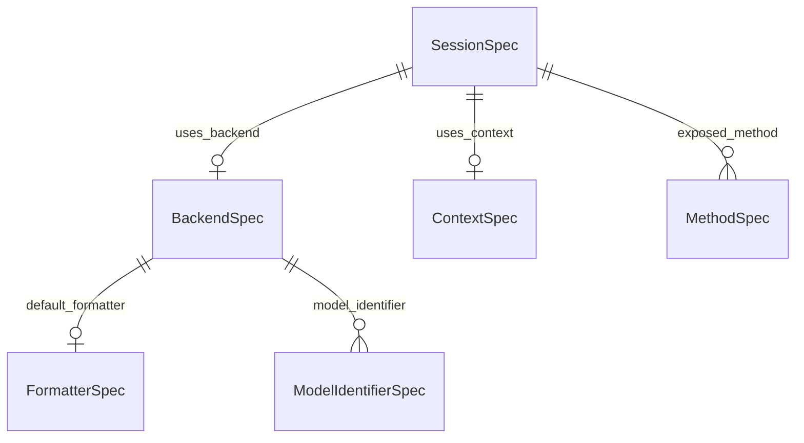

#### Attributes

| Name | Cardinality: | Type | Description |
| --- | --- | --- | --- |
| **[id](#Id)** | <sub>1..1</sub> | uriorcurie | Stable identifier for a schema element. |
| **[name](#Name)** | <sub>1..1</sub> | string | Human-readable name. |
| **[description](#Description)** | <sub>0..1</sub> | string | Narrative description of the element. |
| **[coverage_scope](#CoverageScope)** | <sub>0..\*</sub> | [CoverageScopeEnum](#CoverageScopeEnum) | Where this element surfaces (source/API/CLI/example/test). |
| **[element_kind](#ElementKind)** | <sub>0..1</sub> | [ElementKindEnum](#ElementKindEnum) | Kind of Python declaration. |
| **[module_path](#ModulePath)** | <sub>0..1</sub> | PythonDottedPath | Python module path where this element is defined. |
| **[package_kind](#PackageKind)** | <sub>0..1</sub> | [PackageKindEnum](#PackageKindEnum) | Package bucket. |
| **[source_file](#SourceFile)** | <sub>0..1</sub> | RepositoryRelativePath | Source file relative to repository root. |
| **[tags](#Tags)** | <sub>0..\*</sub> | string | Free-form classification tags. |
| **[backend_family](#BackendFamily)** | <sub>0..1</sub> | [BackendFamilyEnum](#BackendFamilyEnum) | Slot describing the backend family. |
| **[default_formatter](#DefaultFormatter)** | <sub>0..1</sub> | [FormatterSpec](#FormatterSpec) | Slot describing the default formatter. |
| **[model_identifier](#ModelIdentifier)** | <sub>0..\*</sub> | [ModelIdentifierSpec](#ModelIdentifierSpec) | Slot describing the model identifier. |
| **[model_options_key](#ModelOptionsKey)** | <sub>0..\*</sub> | string | Slot describing the model options key. |
| **[supports_multimodal](#SupportsMultimodal)** | <sub>0..1</sub> | boolean | Slot describing the supports multimodal. |
| **[supports_streaming](#SupportsStreaming)** | <sub>0..1</sub> | boolean | Slot describing the supports streaming. |
| **[supports_tool_calls](#SupportsToolCalls)** | <sub>0..1</sub> | boolean | Slot describing the supports tool calls. |

#### Parents

 * [ModelElement](#ModelElement) - Abstract base for concrete architectural elements.

#### Referenced by:

 *  **[SessionSpec](#SessionSpec)** : uses_backend  <sub>0..1</sub> 


### CliCommandSpec

Specification of a CLI command exposed under `m`.


#### Attributes

| Name | Cardinality: | Type | Description |
| --- | --- | --- | --- |
| **[id](#Id)** | <sub>1..1</sub> | uriorcurie | Stable identifier for a schema element. |
| **[name](#Name)** | <sub>1..1</sub> | string | Human-readable name. |
| **[description](#Description)** | <sub>0..1</sub> | string | Narrative description of the element. |
| **[coverage_scope](#CoverageScope)** | <sub>0..\*</sub> | [CoverageScopeEnum](#CoverageScopeEnum) | Where this element surfaces (source/API/CLI/example/test). |
| **[element_kind](#ElementKind)** | <sub>0..1</sub> | [ElementKindEnum](#ElementKindEnum) | Kind of Python declaration. |
| **[module_path](#ModulePath)** | <sub>0..1</sub> | PythonDottedPath | Python module path where this element is defined. |
| **[package_kind](#PackageKind)** | <sub>0..1</sub> | [PackageKindEnum](#PackageKindEnum) | Package bucket. |
| **[source_file](#SourceFile)** | <sub>0..1</sub> | RepositoryRelativePath | Source file relative to repository root. |
| **[tags](#Tags)** | <sub>0..\*</sub> | string | Free-form classification tags. |
| **[command_group](#CommandGroup)** | <sub>0..1</sub> | string | Slot describing the command group. |
| **[command_path](#CommandPath)** | <sub>0..1</sub> | string | Slot describing the command path. |
| **[command_purpose](#CommandPurpose)** | <sub>0..1</sub> | string | Slot describing the command purpose. |
| **[input_model](#InputModel)** | <sub>0..\*</sub> | [ApiModelSpec](#ApiModelSpec) | Slot describing the input model. |
| **[output_model](#OutputModel)** | <sub>0..\*</sub> | [ApiModelSpec](#ApiModelSpec) | Slot describing the output model. |

#### Parents

 * [ModelElement](#ModelElement) - Abstract base for concrete architectural elements.


### ComponentSpec

Specification of a Mellea stdlib component type.


#### Local class diagram

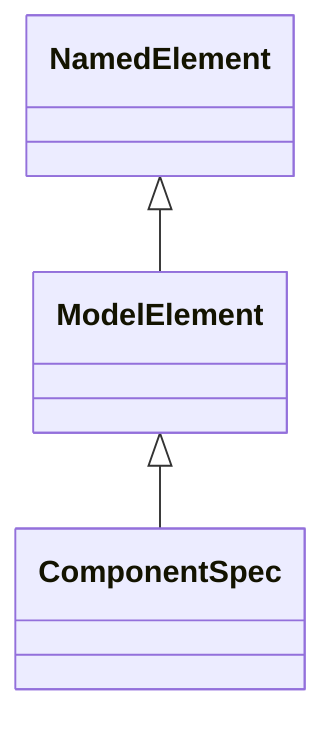

#### Attributes

| Name | Cardinality: | Type | Description |
| --- | --- | --- | --- |
| **[id](#Id)** | <sub>1..1</sub> | uriorcurie | Stable identifier for a schema element. |
| **[name](#Name)** | <sub>1..1</sub> | string | Human-readable name. |
| **[description](#Description)** | <sub>0..1</sub> | string | Narrative description of the element. |
| **[coverage_scope](#CoverageScope)** | <sub>0..\*</sub> | [CoverageScopeEnum](#CoverageScopeEnum) | Where this element surfaces (source/API/CLI/example/test). |
| **[element_kind](#ElementKind)** | <sub>0..1</sub> | [ElementKindEnum](#ElementKindEnum) | Kind of Python declaration. |
| **[module_path](#ModulePath)** | <sub>0..1</sub> | PythonDottedPath | Python module path where this element is defined. |
| **[package_kind](#PackageKind)** | <sub>0..1</sub> | [PackageKindEnum](#PackageKindEnum) | Package bucket. |
| **[source_file](#SourceFile)** | <sub>0..1</sub> | RepositoryRelativePath | Source file relative to repository root. |
| **[tags](#Tags)** | <sub>0..\*</sub> | string | Free-form classification tags. |
| **[component_category](#ComponentCategory)** | <sub>0..1</sub> | [ComponentCategoryEnum](#ComponentCategoryEnum) | Slot describing the component category. |
| **[input_modality](#InputModality)** | <sub>0..\*</sub> | string | Slot describing the input modality. |
| **[parsed_output_type](#ParsedOutputType)** | <sub>0..1</sub> | string | Slot describing the parsed output type. |

#### Parents

 * [ModelElement](#ModelElement) - Abstract base for concrete architectural elements.

#### Referenced by:


### ContextSpec

Specification of a context implementation.

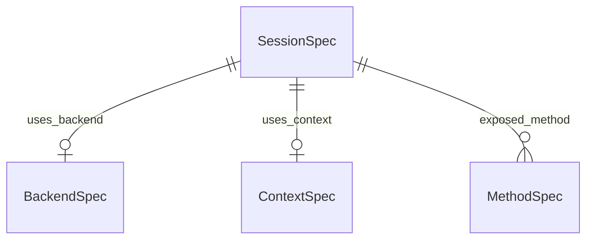

#### Attributes

| Name | Cardinality: | Type | Description |
| --- | --- | --- | --- |
| **[id](#Id)** | <sub>1..1</sub> | uriorcurie | Stable identifier for a schema element. |
| **[name](#Name)** | <sub>1..1</sub> | string | Human-readable name. |
| **[description](#Description)** | <sub>0..1</sub> | string | Narrative description of the element. |
| **[coverage_scope](#CoverageScope)** | <sub>0..\*</sub> | [CoverageScopeEnum](#CoverageScopeEnum) | Where this element surfaces (source/API/CLI/example/test). |
| **[element_kind](#ElementKind)** | <sub>0..1</sub> | [ElementKindEnum](#ElementKindEnum) | Kind of Python declaration. |
| **[module_path](#ModulePath)** | <sub>0..1</sub> | PythonDottedPath | Python module path where this element is defined. |
| **[package_kind](#PackageKind)** | <sub>0..1</sub> | [PackageKindEnum](#PackageKindEnum) | Package bucket. |
| **[source_file](#SourceFile)** | <sub>0..1</sub> | RepositoryRelativePath | Source file relative to repository root. |
| **[tags](#Tags)** | <sub>0..\*</sub> | string | Free-form classification tags. |
| **[accepts_message_attachments](#AcceptsMessageAttachments)** | <sub>0..1</sub> | boolean | Slot describing the accepts message attachments. |
| **[context_linearity](#ContextLinearity)** | <sub>0..1</sub> | [ContextLinearityEnum](#ContextLinearityEnum) | Slot describing the context linearity. |
| **[stores_component_history](#StoresComponentHistory)** | <sub>0..1</sub> | boolean | Slot describing the stores component history. |

#### Parents

 * [ModelElement](#ModelElement) - Abstract base for concrete architectural elements.

#### Referenced by:

 *  **[SessionSpec](#SessionSpec)** : uses_context  <sub>0..1</sub> 


### FormatterSpec

Specification of an output formatter for a backend.

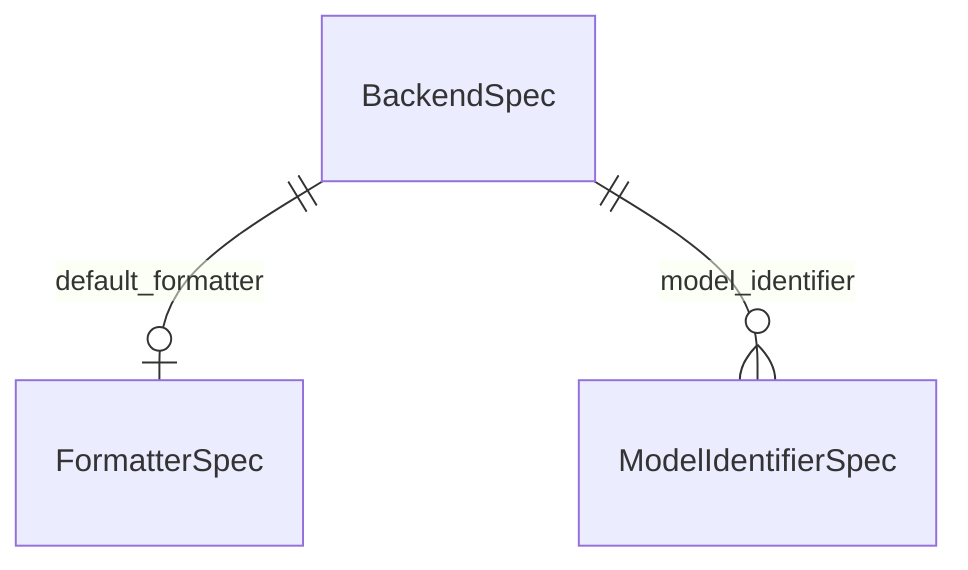

#### Attributes

| Name | Cardinality: | Type | Description |
| --- | --- | --- | --- |
| **[id](#Id)** | <sub>1..1</sub> | uriorcurie | Stable identifier for a schema element. |
| **[name](#Name)** | <sub>1..1</sub> | string | Human-readable name. |
| **[description](#Description)** | <sub>0..1</sub> | string | Narrative description of the element. |
| **[coverage_scope](#CoverageScope)** | <sub>0..\*</sub> | [CoverageScopeEnum](#CoverageScopeEnum) | Where this element surfaces (source/API/CLI/example/test). |
| **[element_kind](#ElementKind)** | <sub>0..1</sub> | [ElementKindEnum](#ElementKindEnum) | Kind of Python declaration. |
| **[module_path](#ModulePath)** | <sub>0..1</sub> | PythonDottedPath | Python module path where this element is defined. |
| **[package_kind](#PackageKind)** | <sub>0..1</sub> | [PackageKindEnum](#PackageKindEnum) | Package bucket. |
| **[source_file](#SourceFile)** | <sub>0..1</sub> | RepositoryRelativePath | Source file relative to repository root. |
| **[tags](#Tags)** | <sub>0..\*</sub> | string | Free-form classification tags. |

#### Parents

 * [ModelElement](#ModelElement) - Abstract base for concrete architectural elements.

#### Referenced by:

 *  **[BackendSpec](#BackendSpec)** : default_formatter  <sub>0..1</sub> 


### HookPayloadSpec

Specification of a hook payload model.

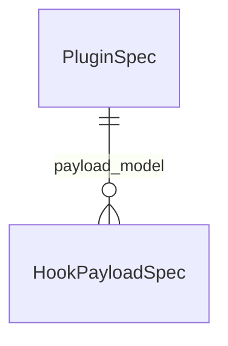

#### Attributes

| Name | Cardinality: | Type | Description |
| --- | --- | --- | --- |
| **[id](#Id)** | <sub>1..1</sub> | uriorcurie | Stable identifier for a schema element. |
| **[name](#Name)** | <sub>1..1</sub> | string | Human-readable name. |
| **[description](#Description)** | <sub>0..1</sub> | string | Narrative description of the element. |
| **[coverage_scope](#CoverageScope)** | <sub>0..\*</sub> | [CoverageScopeEnum](#CoverageScopeEnum) | Where this element surfaces (source/API/CLI/example/test). |
| **[element_kind](#ElementKind)** | <sub>0..1</sub> | [ElementKindEnum](#ElementKindEnum) | Kind of Python declaration. |
| **[module_path](#ModulePath)** | <sub>0..1</sub> | PythonDottedPath | Python module path where this element is defined. |
| **[package_kind](#PackageKind)** | <sub>0..1</sub> | [PackageKindEnum](#PackageKindEnum) | Package bucket. |
| **[source_file](#SourceFile)** | <sub>0..1</sub> | RepositoryRelativePath | Source file relative to repository root. |
| **[tags](#Tags)** | <sub>0..\*</sub> | string | Free-form classification tags. |
| **[hook_type](#HookType)** | <sub>0..\*</sub> | [HookTypeEnum](#HookTypeEnum) | Slot describing the hook type. |
| **[lifecycle_role](#LifecycleRole)** | <sub>0..1</sub> | string | Slot describing the lifecycle role. |

#### Parents

 * [ModelElement](#ModelElement) - Abstract base for concrete architectural elements.

#### Referenced by:

 *  **[PluginSpec](#PluginSpec)** : payload_model  <sub>0..\*</sub> 


### IntrinsicAdapterSpec

Specification of an intrinsic adapter (LoRA / aLoRA).


#### Local class diagram

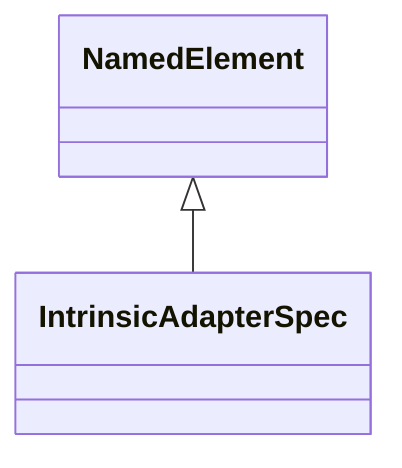

#### Attributes

| Name | Cardinality: | Type | Description |
| --- | --- | --- | --- |
| **[id](#Id)** | <sub>1..1</sub> | uriorcurie | Stable identifier for a schema element. |
| **[name](#Name)** | <sub>1..1</sub> | string | Human-readable name. |
| **[description](#Description)** | <sub>0..1</sub> | string | Narrative description of the element. |
| **[coverage_scope](#CoverageScope)** | <sub>0..\*</sub> | [CoverageScopeEnum](#CoverageScopeEnum) | Where this element surfaces (source/API/CLI/example/test). |
| **[element_kind](#ElementKind)** | <sub>0..1</sub> | [ElementKindEnum](#ElementKindEnum) | Kind of Python declaration. |
| **[module_path](#ModulePath)** | <sub>0..1</sub> | PythonDottedPath | Python module path where this element is defined. |
| **[package_kind](#PackageKind)** | <sub>0..1</sub> | [PackageKindEnum](#PackageKindEnum) | Package bucket. |
| **[source_file](#SourceFile)** | <sub>0..1</sub> | RepositoryRelativePath | Source file relative to repository root. |
| **[tags](#Tags)** | <sub>0..\*</sub> | string | Free-form classification tags. |
| **[adapter_type](#AdapterType)** | <sub>0..\*</sub> | [AdapterTypeEnum](#AdapterTypeEnum) | Slot describing the adapter type. |
| **[repo_id](#RepoId)** | <sub>0..1</sub> | string | Slot describing the repo id. |

#### Parents

 * [NamedElement](#NamedElement) - Abstract base for any named, identifiable schema element.


### MethodSpec

Specification of a method exposed by a runtime class.


#### Attributes

| Name | Cardinality: | Type | Description |
| --- | --- | --- | --- |
| **[id](#Id)** | <sub>1..1</sub> | uriorcurie | Stable identifier for a schema element. |
| **[name](#Name)** | <sub>1..1</sub> | string | Human-readable name. |
| **[description](#Description)** | <sub>0..1</sub> | string | Narrative description of the element. |
| **[coverage_scope](#CoverageScope)** | <sub>0..\*</sub> | [CoverageScopeEnum](#CoverageScopeEnum) | Where this element surfaces (source/API/CLI/example/test). |
| **[element_kind](#ElementKind)** | <sub>0..1</sub> | [ElementKindEnum](#ElementKindEnum) | Kind of Python declaration. |
| **[module_path](#ModulePath)** | <sub>0..1</sub> | PythonDottedPath | Python module path where this element is defined. |
| **[package_kind](#PackageKind)** | <sub>0..1</sub> | [PackageKindEnum](#PackageKindEnum) | Package bucket. |
| **[source_file](#SourceFile)** | <sub>0..1</sub> | RepositoryRelativePath | Source file relative to repository root. |
| **[tags](#Tags)** | <sub>0..\*</sub> | string | Free-form classification tags. |
| **[lifecycle_role](#LifecycleRole)** | <sub>0..1</sub> | string | Slot describing the lifecycle role. |
| **[method_name](#MethodName)** | <sub>0..1</sub> | string | Slot describing the method name. |
| **[method_signature](#MethodSignature)** | <sub>0..1</sub> | string | Slot describing the method signature. |

#### Parents

 * [NamedElement](#NamedElement) - Abstract base for any named, identifiable schema element.

#### Referenced by:

 *  **[SessionSpec](#SessionSpec)** : exposed_method  <sub>0..\*</sub> 


### ModelIdentifierSpec

Cross-provider identifier table for a single model.


#### Attributes

| Name | Cardinality: | Type | Description |
| --- | --- | --- | --- |
| **[id](#Id)** | <sub>1..1</sub> | uriorcurie | Stable identifier for a schema element. |
| **[name](#Name)** | <sub>1..1</sub> | string | Human-readable name. |
| **[description](#Description)** | <sub>0..1</sub> | string | Narrative description of the element. |
| **[coverage_scope](#CoverageScope)** | <sub>0..\*</sub> | [CoverageScopeEnum](#CoverageScopeEnum) | Where this element surfaces (source/API/CLI/example/test). |
| **[element_kind](#ElementKind)** | <sub>0..1</sub> | [ElementKindEnum](#ElementKindEnum) | Kind of Python declaration. |
| **[module_path](#ModulePath)** | <sub>0..1</sub> | PythonDottedPath | Python module path where this element is defined. |
| **[package_kind](#PackageKind)** | <sub>0..1</sub> | [PackageKindEnum](#PackageKindEnum) | Package bucket. |
| **[source_file](#SourceFile)** | <sub>0..1</sub> | RepositoryRelativePath | Source file relative to repository root. |
| **[tags](#Tags)** | <sub>0..\*</sub> | string | Free-form classification tags. |
| **[bedrock_name](#BedrockName)** | <sub>0..1</sub> | string | Slot describing the bedrock name. |
| **[hf_model_name](#HfModelName)** | <sub>0..1</sub> | string | Slot describing the hf model name. |
| **[ollama_name](#OllamaName)** | <sub>0..1</sub> | string | Slot describing the ollama name. |
| **[openai_name](#OpenaiName)** | <sub>0..1</sub> | string | Slot describing the openai name. |
| **[provider_name](#ProviderName)** | <sub>0..\*</sub> | string | Slot describing the provider name. |
| **[watsonx_name](#WatsonxName)** | <sub>0..1</sub> | string | Slot describing the watsonx name. |

#### Parents

 * [NamedElement](#NamedElement) - Abstract base for any named, identifiable schema element.

#### Referenced by:

 *  **[BackendSpec](#BackendSpec)** : model_identifier  <sub>0..\*</sub> 


### PluginSpec

Specification of a Mellea plugin and the hooks it registers.


#### Attributes

| Name | Cardinality: | Type | Description |
| --- | --- | --- | --- |
| **[id](#Id)** | <sub>1..1</sub> | uriorcurie | Stable identifier for a schema element. |
| **[name](#Name)** | <sub>1..1</sub> | string | Human-readable name. |
| **[description](#Description)** | <sub>0..1</sub> | string | Narrative description of the element. |
| **[coverage_scope](#CoverageScope)** | <sub>0..\*</sub> | [CoverageScopeEnum](#CoverageScopeEnum) | Where this element surfaces (source/API/CLI/example/test). |
| **[element_kind](#ElementKind)** | <sub>0..1</sub> | [ElementKindEnum](#ElementKindEnum) | Kind of Python declaration. |
| **[module_path](#ModulePath)** | <sub>0..1</sub> | PythonDottedPath | Python module path where this element is defined. |
| **[package_kind](#PackageKind)** | <sub>0..1</sub> | [PackageKindEnum](#PackageKindEnum) | Package bucket. |
| **[source_file](#SourceFile)** | <sub>0..1</sub> | RepositoryRelativePath | Source file relative to repository root. |
| **[tags](#Tags)** | <sub>0..\*</sub> | string | Free-form classification tags. |
| **[hook_type](#HookType)** | <sub>0..\*</sub> | [HookTypeEnum](#HookTypeEnum) | Slot describing the hook type. |
| **[payload_model](#PayloadModel)** | <sub>0..\*</sub> | [HookPayloadSpec](#HookPayloadSpec) | Slot describing the payload model. |
| **[plugin_mode](#PluginMode)** | <sub>0..1</sub> | [PluginModeEnum](#PluginModeEnum) | Slot describing the plugin mode. |
| **[plugin_priority](#PluginPriority)** | <sub>0..1</sub> | integer | Slot describing the plugin priority. |

#### Parents

 * [ModelElement](#ModelElement) - Abstract base for concrete architectural elements.


### PythonPackage

A logical Python package (directory) inside the repository.

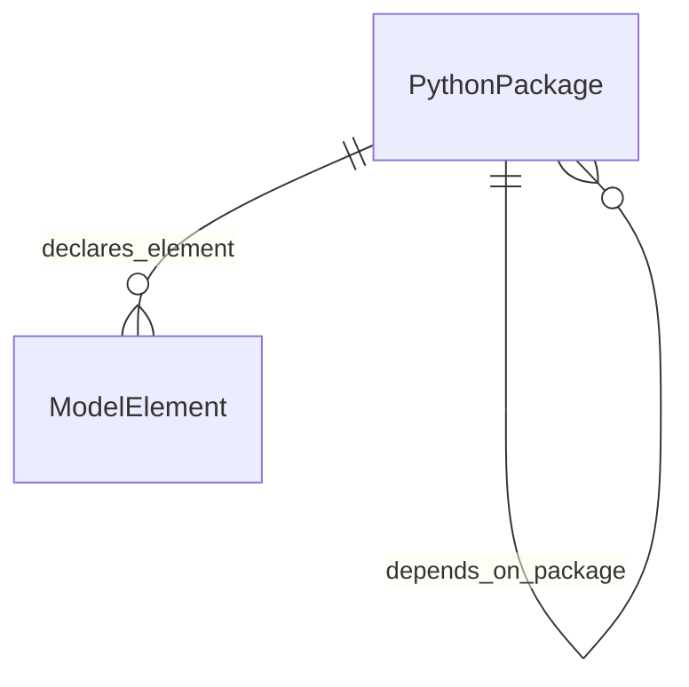

#### Attributes

| Name | Cardinality: | Type | Description |
| --- | --- | --- | --- |
| **[id](#Id)** | <sub>1..1</sub> | uriorcurie | Stable identifier for a schema element. |
| **[name](#Name)** | <sub>1..1</sub> | string | Human-readable name. |
| **[description](#Description)** | <sub>0..1</sub> | string | Narrative description of the element. |
| **[coverage_scope](#CoverageScope)** | <sub>0..\*</sub> | [CoverageScopeEnum](#CoverageScopeEnum) | Where this element surfaces (source/API/CLI/example/test). |
| **[element_kind](#ElementKind)** | <sub>0..1</sub> | [ElementKindEnum](#ElementKindEnum) | Kind of Python declaration. |
| **[module_path](#ModulePath)** | <sub>0..1</sub> | PythonDottedPath | Python module path where this element is defined. |
| **[package_kind](#PackageKind)** | <sub>0..1</sub> | [PackageKindEnum](#PackageKindEnum) | Package bucket. |
| **[source_file](#SourceFile)** | <sub>0..1</sub> | RepositoryRelativePath | Source file relative to repository root. |
| **[tags](#Tags)** | <sub>0..\*</sub> | string | Free-form classification tags. |
| **[declares_element](#DeclaresElement)** | <sub>0..\*</sub> | [ModelElement](#ModelElement) | Slot describing the declares element. |
| **[depends_on_package](#DependsOnPackage)** | <sub>0..\*</sub> | [PythonPackage](#PythonPackage) | Slot describing the depends on package. |
| **[package_name](#PackageName)** | <sub>0..1</sub> | string | Slot describing the package name. |

#### Parents

 * [NamedElement](#NamedElement) - Abstract base for any named, identifiable schema element.

#### Referenced by:

 *  **[PythonPackage](#PythonPackage)** : depends_on_package  <sub>0..\*</sub> 


### RepositoryCatalog

Top-level catalog rooting the analysed repository snapshot.

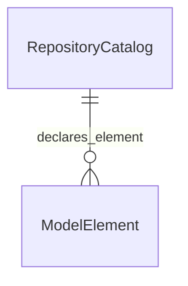

#### Attributes

| Name | Cardinality: | Type | Description |
| --- | --- | --- | --- |
| **[id](#Id)** | <sub>1..1</sub> | uriorcurie | Stable identifier for a schema element. |
| **[name](#Name)** | <sub>1..1</sub> | string | Human-readable name. |
| **[description](#Description)** | <sub>0..1</sub> | string | Narrative description of the element. |
| **[coverage_scope](#CoverageScope)** | <sub>0..\*</sub> | [CoverageScopeEnum](#CoverageScopeEnum) | Where this element surfaces (source/API/CLI/example/test). |
| **[element_kind](#ElementKind)** | <sub>0..1</sub> | [ElementKindEnum](#ElementKindEnum) | Kind of Python declaration. |
| **[module_path](#ModulePath)** | <sub>0..1</sub> | PythonDottedPath | Python module path where this element is defined. |
| **[package_kind](#PackageKind)** | <sub>0..1</sub> | [PackageKindEnum](#PackageKindEnum) | Package bucket. |
| **[source_file](#SourceFile)** | <sub>0..1</sub> | RepositoryRelativePath | Source file relative to repository root. |
| **[tags](#Tags)** | <sub>0..\*</sub> | string | Free-form classification tags. |
| **[analyzed_on](#AnalyzedOn)** | <sub>0..1</sub> | date | Slot describing the analyzed on. |
| **[declares_element](#DeclaresElement)** | <sub>0..\*</sub> | [ModelElement](#ModelElement) | Slot describing the declares element. |
| **[excludes_path](#ExcludesPath)** | <sub>0..\*</sub> | RepositoryRelativePath | Slot describing the excludes path. |
| **[includes_path](#IncludesPath)** | <sub>0..\*</sub> | RepositoryRelativePath | Slot describing the includes path. |
| **[repository_root](#RepositoryRoot)** | <sub>0..1</sub> | RepositoryRelativePath | Slot describing the repository root. |

#### Parents

 * [NamedElement](#NamedElement) - Abstract base for any named, identifiable schema element.


### RequirementSpec

Specification of a requirement validator.


#### Local class diagram

```mermaid
classDiagram
ModelElement <|-- RequirementSpec
NamedElement <|-- ModelElement
```

#### Attributes

| Name | Cardinality: | Type | Description |
| --- | --- | --- | --- |
| **[id](#Id)** | <sub>1..1</sub> | uriorcurie | Stable identifier for a schema element. |
| **[name](#Name)** | <sub>1..1</sub> | string | Human-readable name. |
| **[description](#Description)** | <sub>0..1</sub> | string | Narrative description of the element. |
| **[coverage_scope](#CoverageScope)** | <sub>0..\*</sub> | [CoverageScopeEnum](#CoverageScopeEnum) | Where this element surfaces (source/API/CLI/example/test). |
| **[element_kind](#ElementKind)** | <sub>0..1</sub> | [ElementKindEnum](#ElementKindEnum) | Kind of Python declaration. |
| **[module_path](#ModulePath)** | <sub>0..1</sub> | PythonDottedPath | Python module path where this element is defined. |
| **[package_kind](#PackageKind)** | <sub>0..1</sub> | [PackageKindEnum](#PackageKindEnum) | Package bucket. |
| **[source_file](#SourceFile)** | <sub>0..1</sub> | RepositoryRelativePath | Source file relative to repository root. |
| **[tags](#Tags)** | <sub>0..\*</sub> | string | Free-form classification tags. |
| **[may_trigger_repair](#MayTriggerRepair)** | <sub>0..1</sub> | boolean | Slot describing the may trigger repair. |
| **[validation_style](#ValidationStyle)** | <sub>0..1</sub> | string | Slot describing the validation style. |

#### Parents

 * [ModelElement](#ModelElement) - Abstract base for concrete architectural elements.


### SamplingStrategySpec

Specification of a sampling-loop strategy.


#### Local class diagram

```mermaid
classDiagram
ModelElement <|-- SamplingStrategySpec
NamedElement <|-- ModelElement
```

#### Attributes

| Name | Cardinality: | Type | Description |
| --- | --- | --- | --- |
| **[id](#Id)** | <sub>1..1</sub> | uriorcurie | Stable identifier for a schema element. |
| **[name](#Name)** | <sub>1..1</sub> | string | Human-readable name. |
| **[description](#Description)** | <sub>0..1</sub> | string | Narrative description of the element. |
| **[coverage_scope](#CoverageScope)** | <sub>0..\*</sub> | [CoverageScopeEnum](#CoverageScopeEnum) | Where this element surfaces (source/API/CLI/example/test). |
| **[element_kind](#ElementKind)** | <sub>0..1</sub> | [ElementKindEnum](#ElementKindEnum) | Kind of Python declaration. |
| **[module_path](#ModulePath)** | <sub>0..1</sub> | PythonDottedPath | Python module path where this element is defined. |
| **[package_kind](#PackageKind)** | <sub>0..1</sub> | [PackageKindEnum](#PackageKindEnum) | Package bucket. |
| **[source_file](#SourceFile)** | <sub>0..1</sub> | RepositoryRelativePath | Source file relative to repository root. |
| **[tags](#Tags)** | <sub>0..\*</sub> | string | Free-form classification tags. |
| **[loop_budget_hint](#LoopBudgetHint)** | <sub>0..1</sub> | integer | Slot describing the loop budget hint. |
| **[may_trigger_repair](#MayTriggerRepair)** | <sub>0..1</sub> | boolean | Slot describing the may trigger repair. |
| **[selection_policy](#SelectionPolicy)** | <sub>0..1</sub> | string | Slot describing the selection policy. |

#### Parents

 * [ModelElement](#ModelElement) - Abstract base for concrete architectural elements.


### SessionSpec

Specification of a Mellea session.

```mermaid
erDiagram
BackendSpec {

}
ContextSpec {

}
MethodSpec {

}
SessionSpec {

}

BackendSpec ||--|o FormatterSpec : "default_formatter"
BackendSpec ||--}o ModelIdentifierSpec : "model_identifier"
SessionSpec ||--|o BackendSpec : "uses_backend"
SessionSpec ||--|o ContextSpec : "uses_context"
SessionSpec ||--}o MethodSpec : "exposed_method"

```

#### Attributes

| Name | Cardinality: | Type | Description |
| --- | --- | --- | --- |
| **[id](#Id)** | <sub>1..1</sub> | uriorcurie | Stable identifier for a schema element. |
| **[name](#Name)** | <sub>1..1</sub> | string | Human-readable name. |
| **[description](#Description)** | <sub>0..1</sub> | string | Narrative description of the element. |
| **[coverage_scope](#CoverageScope)** | <sub>0..\*</sub> | [CoverageScopeEnum](#CoverageScopeEnum) | Where this element surfaces (source/API/CLI/example/test). |
| **[element_kind](#ElementKind)** | <sub>0..1</sub> | [ElementKindEnum](#ElementKindEnum) | Kind of Python declaration. |
| **[module_path](#ModulePath)** | <sub>0..1</sub> | PythonDottedPath | Python module path where this element is defined. |
| **[package_kind](#PackageKind)** | <sub>0..1</sub> | [PackageKindEnum](#PackageKindEnum) | Package bucket. |
| **[source_file](#SourceFile)** | <sub>0..1</sub> | RepositoryRelativePath | Source file relative to repository root. |
| **[tags](#Tags)** | <sub>0..\*</sub> | string | Free-form classification tags. |
| **[exposed_method](#ExposedMethod)** | <sub>0..\*</sub> | [MethodSpec](#MethodSpec) | Slot describing the exposed method. |
| **[uses_backend](#UsesBackend)** | <sub>0..1</sub> | [BackendSpec](#BackendSpec) | Slot describing the uses backend. |
| **[uses_context](#UsesContext)** | <sub>0..1</sub> | [ContextSpec](#ContextSpec) | Slot describing the uses context. |

#### Parents

 * [ModelElement](#ModelElement) - Abstract base for concrete architectural elements.


### TelemetryMetricSpec

Specification of a telemetry metric emitted by Mellea.


#### Local class diagram

```mermaid
classDiagram
ModelElement <|-- TelemetryMetricSpec
NamedElement <|-- ModelElement
```

#### Attributes

| Name | Cardinality: | Type | Description |
| --- | --- | --- | --- |
| **[id](#Id)** | <sub>1..1</sub> | uriorcurie | Stable identifier for a schema element. |
| **[name](#Name)** | <sub>1..1</sub> | string | Human-readable name. |
| **[description](#Description)** | <sub>0..1</sub> | string | Narrative description of the element. |
| **[coverage_scope](#CoverageScope)** | <sub>0..\*</sub> | [CoverageScopeEnum](#CoverageScopeEnum) | Where this element surfaces (source/API/CLI/example/test). |
| **[element_kind](#ElementKind)** | <sub>0..1</sub> | [ElementKindEnum](#ElementKindEnum) | Kind of Python declaration. |
| **[module_path](#ModulePath)** | <sub>0..1</sub> | PythonDottedPath | Python module path where this element is defined. |
| **[package_kind](#PackageKind)** | <sub>0..1</sub> | [PackageKindEnum](#PackageKindEnum) | Package bucket. |
| **[source_file](#SourceFile)** | <sub>0..1</sub> | RepositoryRelativePath | Source file relative to repository root. |
| **[tags](#Tags)** | <sub>0..\*</sub> | string | Free-form classification tags. |
| **[metric_name](#MetricName)** | <sub>0..\*</sub> | string | Slot describing the metric name. |

#### Parents

 * [ModelElement](#ModelElement) - Abstract base for concrete architectural elements.


## Slots

| Name | Cardinality/Range | Used By |
| --- | --- | --- |
| <a id="Id"></a>**id**<br/>Stable identifier for a schema element. | <sub>1..1</sub><br/>uriorcurie | [ApiFieldSpec](#ApiFieldSpec), [ApiModelSpec](#ApiModelSpec), [BackendSpec](#BackendSpec), [CliCommandSpec](#CliCommandSpec), [ComponentSpec](#ComponentSpec), [ContextSpec](#ContextSpec), [FormatterSpec](#FormatterSpec), [HookPayloadSpec](#HookPayloadSpec), [IntrinsicAdapterSpec](#IntrinsicAdapterSpec), [MethodSpec](#MethodSpec), [ModelElement](#ModelElement), [ModelIdentifierSpec](#ModelIdentifierSpec), [NamedElement](#NamedElement), [PluginSpec](#PluginSpec), [PythonPackage](#PythonPackage), [RepositoryCatalog](#RepositoryCatalog), [RequirementSpec](#RequirementSpec), [SamplingStrategySpec](#SamplingStrategySpec), [SessionSpec](#SessionSpec), [TelemetryMetricSpec](#TelemetryMetricSpec) |
| <a id="Name"></a>**name**<br/>Human-readable name. | <sub>1..1</sub><br/>string | [ApiFieldSpec](#ApiFieldSpec), [ApiModelSpec](#ApiModelSpec), [BackendSpec](#BackendSpec), [CliCommandSpec](#CliCommandSpec), [ComponentSpec](#ComponentSpec), [ContextSpec](#ContextSpec), [FormatterSpec](#FormatterSpec), [HookPayloadSpec](#HookPayloadSpec), [IntrinsicAdapterSpec](#IntrinsicAdapterSpec), [MethodSpec](#MethodSpec), [ModelElement](#ModelElement), [ModelIdentifierSpec](#ModelIdentifierSpec), [NamedElement](#NamedElement), [PluginSpec](#PluginSpec), [PythonPackage](#PythonPackage), [RepositoryCatalog](#RepositoryCatalog), [RequirementSpec](#RequirementSpec), [SamplingStrategySpec](#SamplingStrategySpec), [SessionSpec](#SessionSpec), [TelemetryMetricSpec](#TelemetryMetricSpec) |
| <a id="Description"></a>**description**<br/>Narrative description of the element. | <sub>0..1</sub><br/>string | [ApiFieldSpec](#ApiFieldSpec), [ApiModelSpec](#ApiModelSpec), [BackendSpec](#BackendSpec), [CliCommandSpec](#CliCommandSpec), [ComponentSpec](#ComponentSpec), [ContextSpec](#ContextSpec), [FormatterSpec](#FormatterSpec), [HookPayloadSpec](#HookPayloadSpec), [IntrinsicAdapterSpec](#IntrinsicAdapterSpec), [MethodSpec](#MethodSpec), [ModelElement](#ModelElement), [ModelIdentifierSpec](#ModelIdentifierSpec), [NamedElement](#NamedElement), [PluginSpec](#PluginSpec), [PythonPackage](#PythonPackage), [RepositoryCatalog](#RepositoryCatalog), [RequirementSpec](#RequirementSpec), [SamplingStrategySpec](#SamplingStrategySpec), [SessionSpec](#SessionSpec), [TelemetryMetricSpec](#TelemetryMetricSpec) |
| <a id="AcceptsMessageAttachments"></a>**accepts_message_attachments**<br/>Slot describing the accepts message attachments. | <sub>0..1</sub><br/>boolean | [ContextSpec](#ContextSpec) |
| <a id="AdapterType"></a>**adapter_type**<br/>Slot describing the adapter type. | <sub>0..\*</sub><br/>[AdapterTypeEnum](#AdapterTypeEnum) | [IntrinsicAdapterSpec](#IntrinsicAdapterSpec) |
| <a id="AllowsNull"></a>**allows_null**<br/>Slot describing the allows null. | <sub>0..1</sub><br/>boolean | [ApiFieldSpec](#ApiFieldSpec) |
| <a id="AnalyzedOn"></a>**analyzed_on**<br/>Slot describing the analyzed on. | <sub>0..1</sub><br/>date | [RepositoryCatalog](#RepositoryCatalog) |
| <a id="BackendFamily"></a>**backend_family**<br/>Slot describing the backend family. | <sub>0..1</sub><br/>[BackendFamilyEnum](#BackendFamilyEnum) | [BackendSpec](#BackendSpec) |
| <a id="BedrockName"></a>**bedrock_name**<br/>Slot describing the bedrock name. | <sub>0..1</sub><br/>string | [ModelIdentifierSpec](#ModelIdentifierSpec) |
| <a id="CommandGroup"></a>**command_group**<br/>Slot describing the command group. | <sub>0..1</sub><br/>string | [CliCommandSpec](#CliCommandSpec) |
| <a id="CommandPath"></a>**command_path**<br/>Slot describing the command path. | <sub>0..1</sub><br/>string | [CliCommandSpec](#CliCommandSpec) |
| <a id="CommandPurpose"></a>**command_purpose**<br/>Slot describing the command purpose. | <sub>0..1</sub><br/>string | [CliCommandSpec](#CliCommandSpec) |
| <a id="ComponentCategory"></a>**component_category**<br/>Slot describing the component category. | <sub>0..1</sub><br/>[ComponentCategoryEnum](#ComponentCategoryEnum) | [ComponentSpec](#ComponentSpec) |
| <a id="ContextLinearity"></a>**context_linearity**<br/>Slot describing the context linearity. | <sub>0..1</sub><br/>[ContextLinearityEnum](#ContextLinearityEnum) | [ContextSpec](#ContextSpec) |
| <a id="CoverageScope"></a>**coverage_scope**<br/>Where this element surfaces (source/API/CLI/example/test). | <sub>0..\*</sub><br/>[CoverageScopeEnum](#CoverageScopeEnum) | [ApiFieldSpec](#ApiFieldSpec), [ApiModelSpec](#ApiModelSpec), [BackendSpec](#BackendSpec), [CliCommandSpec](#CliCommandSpec), [ComponentSpec](#ComponentSpec), [ContextSpec](#ContextSpec), [FormatterSpec](#FormatterSpec), [HookPayloadSpec](#HookPayloadSpec), [IntrinsicAdapterSpec](#IntrinsicAdapterSpec), [MethodSpec](#MethodSpec), [ModelElement](#ModelElement), [ModelIdentifierSpec](#ModelIdentifierSpec), [NamedElement](#NamedElement), [PluginSpec](#PluginSpec), [PythonPackage](#PythonPackage), [RepositoryCatalog](#RepositoryCatalog), [RequirementSpec](#RequirementSpec), [SamplingStrategySpec](#SamplingStrategySpec), [SessionSpec](#SessionSpec), [TelemetryMetricSpec](#TelemetryMetricSpec) |
| <a id="DeclaresElement"></a>**declares_element**<br/>Slot describing the declares element. | <sub>0..\*</sub><br/>[ModelElement](#ModelElement) | [PythonPackage](#PythonPackage), [RepositoryCatalog](#RepositoryCatalog) |
| <a id="DefaultFormatter"></a>**default_formatter**<br/>Slot describing the default formatter. | <sub>0..1</sub><br/>[FormatterSpec](#FormatterSpec) | [BackendSpec](#BackendSpec) |
| <a id="DependsOnPackage"></a>**depends_on_package**<br/>Slot describing the depends on package. | <sub>0..\*</sub><br/>[PythonPackage](#PythonPackage) | [PythonPackage](#PythonPackage) |
| <a id="ElementKind"></a>**element_kind**<br/>Kind of Python declaration. | <sub>0..1</sub><br/>[ElementKindEnum](#ElementKindEnum) | [ApiFieldSpec](#ApiFieldSpec), [ApiModelSpec](#ApiModelSpec), [BackendSpec](#BackendSpec), [CliCommandSpec](#CliCommandSpec), [ComponentSpec](#ComponentSpec), [ContextSpec](#ContextSpec), [FormatterSpec](#FormatterSpec), [HookPayloadSpec](#HookPayloadSpec), [IntrinsicAdapterSpec](#IntrinsicAdapterSpec), [MethodSpec](#MethodSpec), [ModelElement](#ModelElement), [ModelIdentifierSpec](#ModelIdentifierSpec), [NamedElement](#NamedElement), [PluginSpec](#PluginSpec), [PythonPackage](#PythonPackage), [RepositoryCatalog](#RepositoryCatalog), [RequirementSpec](#RequirementSpec), [SamplingStrategySpec](#SamplingStrategySpec), [SessionSpec](#SessionSpec), [TelemetryMetricSpec](#TelemetryMetricSpec) |
| <a id="ExcludesPath"></a>**excludes_path**<br/>Slot describing the excludes path. | <sub>0..\*</sub><br/>RepositoryRelativePath | [RepositoryCatalog](#RepositoryCatalog) |
| <a id="ExposedMethod"></a>**exposed_method**<br/>Slot describing the exposed method. | <sub>0..\*</sub><br/>[MethodSpec](#MethodSpec) | [SessionSpec](#SessionSpec) |
| <a id="FieldName"></a>**field_name**<br/>Slot describing the field name. | <sub>0..1</sub><br/>string | [ApiFieldSpec](#ApiFieldSpec) |
| <a id="FieldType"></a>**field_type**<br/>Slot describing the field type. | <sub>0..1</sub><br/>string | [ApiFieldSpec](#ApiFieldSpec) |
| <a id="HasField"></a>**has_field**<br/>Slot describing the has field. | <sub>0..\*</sub><br/>[ApiFieldSpec](#ApiFieldSpec) | [ApiModelSpec](#ApiModelSpec) |
| <a id="HfModelName"></a>**hf_model_name**<br/>Slot describing the hf model name. | <sub>0..1</sub><br/>string | [ModelIdentifierSpec](#ModelIdentifierSpec) |
| <a id="HookType"></a>**hook_type**<br/>Slot describing the hook type. | <sub>0..\*</sub><br/>[HookTypeEnum](#HookTypeEnum) | [HookPayloadSpec](#HookPayloadSpec), [PluginSpec](#PluginSpec) |
| <a id="IncludesPath"></a>**includes_path**<br/>Slot describing the includes path. | <sub>0..\*</sub><br/>RepositoryRelativePath | [RepositoryCatalog](#RepositoryCatalog) |
| <a id="InputModality"></a>**input_modality**<br/>Slot describing the input modality. | <sub>0..\*</sub><br/>string | [ComponentSpec](#ComponentSpec) |
| <a id="InputModel"></a>**input_model**<br/>Slot describing the input model. | <sub>0..\*</sub><br/>[ApiModelSpec](#ApiModelSpec) | [CliCommandSpec](#CliCommandSpec) |
| <a id="LifecycleRole"></a>**lifecycle_role**<br/>Slot describing the lifecycle role. | <sub>0..1</sub><br/>string | [HookPayloadSpec](#HookPayloadSpec), [MethodSpec](#MethodSpec) |
| <a id="LoopBudgetHint"></a>**loop_budget_hint**<br/>Slot describing the loop budget hint. | <sub>0..1</sub><br/>integer | [SamplingStrategySpec](#SamplingStrategySpec) |
| <a id="MayTriggerRepair"></a>**may_trigger_repair**<br/>Slot describing the may trigger repair. | <sub>0..1</sub><br/>boolean | [RequirementSpec](#RequirementSpec), [SamplingStrategySpec](#SamplingStrategySpec) |
| <a id="MethodName"></a>**method_name**<br/>Slot describing the method name. | <sub>0..1</sub><br/>string | [MethodSpec](#MethodSpec) |
| <a id="MethodSignature"></a>**method_signature**<br/>Slot describing the method signature. | <sub>0..1</sub><br/>string | [MethodSpec](#MethodSpec) |
| <a id="MetricName"></a>**metric_name**<br/>Slot describing the metric name. | <sub>0..\*</sub><br/>string | [TelemetryMetricSpec](#TelemetryMetricSpec) |
| <a id="ModelIdentifier"></a>**model_identifier**<br/>Slot describing the model identifier. | <sub>0..\*</sub><br/>[ModelIdentifierSpec](#ModelIdentifierSpec) | [BackendSpec](#BackendSpec) |
| <a id="ModelOptionsKey"></a>**model_options_key**<br/>Slot describing the model options key. | <sub>0..\*</sub><br/>string | [BackendSpec](#BackendSpec) |
| <a id="ModulePath"></a>**module_path**<br/>Python module path where this element is defined. | <sub>0..1</sub><br/>PythonDottedPath | [ApiFieldSpec](#ApiFieldSpec), [ApiModelSpec](#ApiModelSpec), [BackendSpec](#BackendSpec), [CliCommandSpec](#CliCommandSpec), [ComponentSpec](#ComponentSpec), [ContextSpec](#ContextSpec), [FormatterSpec](#FormatterSpec), [HookPayloadSpec](#HookPayloadSpec), [IntrinsicAdapterSpec](#IntrinsicAdapterSpec), [MethodSpec](#MethodSpec), [ModelElement](#ModelElement), [ModelIdentifierSpec](#ModelIdentifierSpec), [NamedElement](#NamedElement), [PluginSpec](#PluginSpec), [PythonPackage](#PythonPackage), [RepositoryCatalog](#RepositoryCatalog), [RequirementSpec](#RequirementSpec), [SamplingStrategySpec](#SamplingStrategySpec), [SessionSpec](#SessionSpec), [TelemetryMetricSpec](#TelemetryMetricSpec) |
| <a id="OllamaName"></a>**ollama_name**<br/>Slot describing the ollama name. | <sub>0..1</sub><br/>string | [ModelIdentifierSpec](#ModelIdentifierSpec) |
| <a id="OpenaiName"></a>**openai_name**<br/>Slot describing the openai name. | <sub>0..1</sub><br/>string | [ModelIdentifierSpec](#ModelIdentifierSpec) |
| <a id="OpenaiObjectType"></a>**openai_object_type**<br/>Slot describing the openai object type. | <sub>0..1</sub><br/>string | [ApiModelSpec](#ApiModelSpec) |
| <a id="OutputModel"></a>**output_model**<br/>Slot describing the output model. | <sub>0..\*</sub><br/>[ApiModelSpec](#ApiModelSpec) | [CliCommandSpec](#CliCommandSpec) |
| <a id="PackageKind"></a>**package_kind**<br/>Package bucket. | <sub>0..1</sub><br/>[PackageKindEnum](#PackageKindEnum) | [ApiFieldSpec](#ApiFieldSpec), [ApiModelSpec](#ApiModelSpec), [BackendSpec](#BackendSpec), [CliCommandSpec](#CliCommandSpec), [ComponentSpec](#ComponentSpec), [ContextSpec](#ContextSpec), [FormatterSpec](#FormatterSpec), [HookPayloadSpec](#HookPayloadSpec), [IntrinsicAdapterSpec](#IntrinsicAdapterSpec), [MethodSpec](#MethodSpec), [ModelElement](#ModelElement), [ModelIdentifierSpec](#ModelIdentifierSpec), [NamedElement](#NamedElement), [PluginSpec](#PluginSpec), [PythonPackage](#PythonPackage), [RepositoryCatalog](#RepositoryCatalog), [RequirementSpec](#RequirementSpec), [SamplingStrategySpec](#SamplingStrategySpec), [SessionSpec](#SessionSpec), [TelemetryMetricSpec](#TelemetryMetricSpec) |
| <a id="PackageName"></a>**package_name**<br/>Slot describing the package name. | <sub>0..1</sub><br/>string | [PythonPackage](#PythonPackage) |
| <a id="ParsedOutputType"></a>**parsed_output_type**<br/>Slot describing the parsed output type. | <sub>0..1</sub><br/>string | [ComponentSpec](#ComponentSpec) |
| <a id="PayloadModel"></a>**payload_model**<br/>Slot describing the payload model. | <sub>0..\*</sub><br/>[HookPayloadSpec](#HookPayloadSpec) | [PluginSpec](#PluginSpec) |
| <a id="PluginMode"></a>**plugin_mode**<br/>Slot describing the plugin mode. | <sub>0..1</sub><br/>[PluginModeEnum](#PluginModeEnum) | [PluginSpec](#PluginSpec) |
| <a id="PluginPriority"></a>**plugin_priority**<br/>Slot describing the plugin priority. | <sub>0..1</sub><br/>integer | [PluginSpec](#PluginSpec) |
| <a id="ProviderName"></a>**provider_name**<br/>Slot describing the provider name. | <sub>0..\*</sub><br/>string | [ModelIdentifierSpec](#ModelIdentifierSpec) |
| <a id="RepoId"></a>**repo_id**<br/>Slot describing the repo id. | <sub>0..1</sub><br/>string | [IntrinsicAdapterSpec](#IntrinsicAdapterSpec) |
| <a id="RepositoryRoot"></a>**repository_root**<br/>Slot describing the repository root. | <sub>0..1</sub><br/>RepositoryRelativePath | [RepositoryCatalog](#RepositoryCatalog) |
| <a id="RequestOrResponse"></a>**request_or_response**<br/>Slot describing the request or response. | <sub>0..1</sub><br/>[RequestResponseEnum](#RequestResponseEnum) | [ApiModelSpec](#ApiModelSpec) |
| <a id="RequiredField"></a>**required_field**<br/>Slot describing the required field. | <sub>0..1</sub><br/>boolean | [ApiFieldSpec](#ApiFieldSpec) |
| <a id="SelectionPolicy"></a>**selection_policy**<br/>Slot describing the selection policy. | <sub>0..1</sub><br/>string | [SamplingStrategySpec](#SamplingStrategySpec) |
| <a id="SourceFile"></a>**source_file**<br/>Source file relative to repository root. | <sub>0..1</sub><br/>RepositoryRelativePath | [ApiFieldSpec](#ApiFieldSpec), [ApiModelSpec](#ApiModelSpec), [BackendSpec](#BackendSpec), [CliCommandSpec](#CliCommandSpec), [ComponentSpec](#ComponentSpec), [ContextSpec](#ContextSpec), [FormatterSpec](#FormatterSpec), [HookPayloadSpec](#HookPayloadSpec), [IntrinsicAdapterSpec](#IntrinsicAdapterSpec), [MethodSpec](#MethodSpec), [ModelElement](#ModelElement), [ModelIdentifierSpec](#ModelIdentifierSpec), [NamedElement](#NamedElement), [PluginSpec](#PluginSpec), [PythonPackage](#PythonPackage), [RepositoryCatalog](#RepositoryCatalog), [RequirementSpec](#RequirementSpec), [SamplingStrategySpec](#SamplingStrategySpec), [SessionSpec](#SessionSpec), [TelemetryMetricSpec](#TelemetryMetricSpec) |
| <a id="StoresComponentHistory"></a>**stores_component_history**<br/>Slot describing the stores component history. | <sub>0..1</sub><br/>boolean | [ContextSpec](#ContextSpec) |
| <a id="SupportsMultimodal"></a>**supports_multimodal**<br/>Slot describing the supports multimodal. | <sub>0..1</sub><br/>boolean | [BackendSpec](#BackendSpec) |
| <a id="SupportsStreaming"></a>**supports_streaming**<br/>Slot describing the supports streaming. | <sub>0..1</sub><br/>boolean | [BackendSpec](#BackendSpec) |
| <a id="SupportsToolCalls"></a>**supports_tool_calls**<br/>Slot describing the supports tool calls. | <sub>0..1</sub><br/>boolean | [BackendSpec](#BackendSpec) |
| <a id="Tags"></a>**tags**<br/>Free-form classification tags. | <sub>0..\*</sub><br/>string | [ApiFieldSpec](#ApiFieldSpec), [ApiModelSpec](#ApiModelSpec), [BackendSpec](#BackendSpec), [CliCommandSpec](#CliCommandSpec), [ComponentSpec](#ComponentSpec), [ContextSpec](#ContextSpec), [FormatterSpec](#FormatterSpec), [HookPayloadSpec](#HookPayloadSpec), [IntrinsicAdapterSpec](#IntrinsicAdapterSpec), [MethodSpec](#MethodSpec), [ModelElement](#ModelElement), [ModelIdentifierSpec](#ModelIdentifierSpec), [NamedElement](#NamedElement), [PluginSpec](#PluginSpec), [PythonPackage](#PythonPackage), [RepositoryCatalog](#RepositoryCatalog), [RequirementSpec](#RequirementSpec), [SamplingStrategySpec](#SamplingStrategySpec), [SessionSpec](#SessionSpec), [TelemetryMetricSpec](#TelemetryMetricSpec) |
| <a id="UsesBackend"></a>**uses_backend**<br/>Slot describing the uses backend. | <sub>0..1</sub><br/>[BackendSpec](#BackendSpec) | [SessionSpec](#SessionSpec) |
| <a id="UsesComponentType"></a>**uses_component_type**<br/>Slot describing the uses component type. | <sub>0..\*</sub><br/>[ComponentSpec](#ComponentSpec) |  |
| <a id="UsesContext"></a>**uses_context**<br/>Slot describing the uses context. | <sub>0..1</sub><br/>[ContextSpec](#ContextSpec) | [SessionSpec](#SessionSpec) |
| <a id="ValidationStyle"></a>**validation_style**<br/>Slot describing the validation style. | <sub>0..1</sub><br/>string | [RequirementSpec](#RequirementSpec) |
| <a id="WatsonxName"></a>**watsonx_name**<br/>Slot describing the watsonx name. | <sub>0..1</sub><br/>string | [ModelIdentifierSpec](#ModelIdentifierSpec) |

## Enums


### AdapterTypeEnum

Adapter implementation type (derived from AdapterType).

| Text | Meaning: | Description |
| --- | --- | --- |
| ALORA | None | alora |
| LORA | None | lora |

#### Used by

 *  **[IntrinsicAdapterSpec](#IntrinsicAdapterSpec)** *[adapter_type](#AdapterType)*  <sub>0..\*</sub> 

### BackendFamilyEnum

Backend families discovered under mellea/backends/.

| Text | Meaning: | Description |
| --- | --- | --- |
| BEDROCK | None | Backend family backed by mellea/backends/bedrock.py. |
| DUMMY | None | Backend family backed by mellea/backends/dummy.py. |
| HUGGINGFACE | None | Backend family backed by mellea/backends/huggingface.py. |
| LITELLM | None | Backend family backed by mellea/backends/litellm.py. |
| OLLAMA | None | Backend family backed by mellea/backends/ollama.py. |
| OPENAI | None | Backend family backed by mellea/backends/openai.py. |
| WATSONX | None | Backend family backed by mellea/backends/watsonx.py. |

#### Used by

 *  **[BackendSpec](#BackendSpec)** *[backend_family](#BackendFamily)*  <sub>0..1</sub> 

### ComponentCategoryEnum

High-level category of a Mellea stdlib component.

| Text | Meaning: | Description |
| --- | --- | --- |
| DOCUMENT | None | document |
| GENSTUB | None | genstub |
| INSTRUCTION | None | instruction |
| INTRINSIC | None | intrinsic |
| MESSAGE | None | message |
| MOBJECT | None | mobject |
| QUERY | None | query |
| REQUIREMENT | None | requirement |
| STREAM_EVENT | None | stream event |
| TOOL_MESSAGE | None | tool message |
| TRANSFORM | None | transform |

#### Used by

 *  **[ComponentSpec](#ComponentSpec)** *[component_category](#ComponentCategory)*  <sub>0..1</sub> 

### ContextLinearityEnum

Whether a Mellea context preserves linear ordering or not.

| Text | Meaning: | Description |
| --- | --- | --- |
| LINEAR | None | Sequential, ordered history. |
| NON_LINEAR | None | Tree- or graph-shaped history. |

#### Used by

 *  **[ContextSpec](#ContextSpec)** *[context_linearity](#ContextLinearity)*  <sub>0..1</sub> 

### CoverageScopeEnum

Where in the project an element surfaces (source, API, CLI, ...).

| Text | Meaning: | Description |
| --- | --- | --- |
| API | None | api |
| CLI | None | cli |
| EXAMPLE | None | example |
| SOURCE | None | source |
| TEST | None | test |

#### Used by

 *  **[NamedElement](#NamedElement)** *[coverage_scope](#CoverageScope)*  <sub>0..\*</sub> 

### ElementKindEnum

Kind of Python declaration captured by a ModelElement entry.

| Text | Meaning: | Description |
| --- | --- | --- |
| CLASS | None | class |
| DATACLASS | None | dataclass |
| ENUM | None | enum |
| FUNCTION | None | function |
| MIXIN | None | mixin |
| PROTOCOL | None | protocol |
| PYDANTIC_MODEL | None | pydantic model |
| TYPED_DICT | None | typed dict |

#### Used by

 *  **[NamedElement](#NamedElement)** *[element_kind](#ElementKind)*  <sub>0..1</sub> 

### HookTypeEnum

Lifecycle hook stages (derived from HookType).

| Text | Meaning: | Description |
| --- | --- | --- |
| COMPONENT_POST_ERROR | None | component post error |
| COMPONENT_POST_SUCCESS | None | component post success |
| COMPONENT_PRE_EXECUTE | None | component pre execute |
| GENERATION_ERROR | None | generation error |
| GENERATION_POST_CALL | None | generation post call |
| GENERATION_PRE_CALL | None | generation pre call |
| SAMPLING_ITERATION | None | sampling iteration |
| SAMPLING_LOOP_END | None | sampling loop end |
| SAMPLING_LOOP_START | None | sampling loop start |
| SAMPLING_REPAIR | None | sampling repair |
| SESSION_CLEANUP | None | session cleanup |
| SESSION_POST_INIT | None | session post init |
| SESSION_PRE_INIT | None | session pre init |
| SESSION_RESET | None | session reset |
| TOOL_POST_INVOKE | None | tool post invoke |
| TOOL_PRE_INVOKE | None | tool pre invoke |
| VALIDATION_POST_CHECK | None | validation post check |
| VALIDATION_PRE_CHECK | None | validation pre check |

#### Used by

 *  **[HookPayloadSpec](#HookPayloadSpec)** *[hook_type](#HookType)*  <sub>0..\*</sub> 
 *  **[PluginSpec](#PluginSpec)** *[hook_type](#HookType)*  <sub>0..\*</sub> 

### PackageKindEnum

Logical package buckets used to classify Mellea source modules.

| Text | Meaning: | Description |
| --- | --- | --- |
| BACKENDS | None | backends |
| CLI | None | cli |
| CORE | None | core |
| DOCS_EXAMPLES | None | docs examples |
| FORMATTERS | None | formatters |
| HELPERS | None | helpers |
| PLUGINS | None | plugins |
| STDLIB | None | stdlib |
| TELEMETRY | None | telemetry |
| TEST | None | test |

#### Used by

 *  **[NamedElement](#NamedElement)** *[package_kind](#PackageKind)*  <sub>0..1</sub> 

### PluginModeEnum

Execution mode of a Mellea plugin (derived from PluginMode).

| Text | Meaning: | Description |
| --- | --- | --- |
| AUDIT | None | audit |
| CONCURRENT | None | concurrent |
| FIRE_AND_FORGET | None | fire and forget |
| SEQUENTIAL | None | sequential |
| TRANSFORM | None | transform |

#### Used by

 *  **[PluginSpec](#PluginSpec)** *[plugin_mode](#PluginMode)*  <sub>0..1</sub> 

### RequestResponseEnum

Direction of a wire model (HTTP request, response, or both).

| Text | Meaning: | Description |
| --- | --- | --- |
| BOTH | None | Model used in both directions (rare). |
| REQUEST | None | Inbound request payload. |
| RESPONSE | None | Outbound response payload. |

#### Used by

 *  **[ApiModelSpec](#ApiModelSpec)** *[request_or_response](#RequestOrResponse)*  <sub>0..1</sub>

