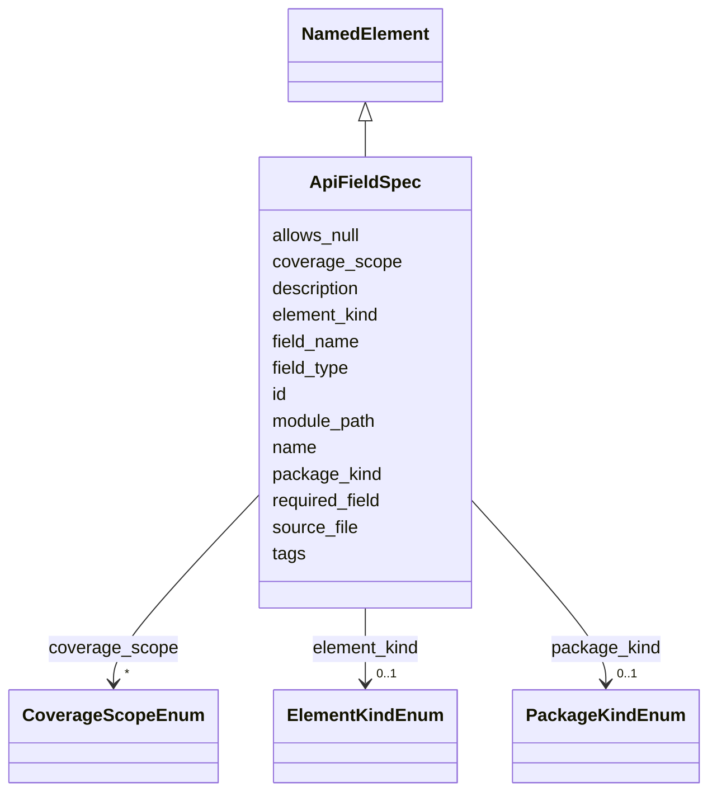

```mermaid
 classDiagram
    class ApiFieldSpec
    click ApiFieldSpec href "../ApiFieldSpec"
      NamedElement <|-- ApiFieldSpec
        click NamedElement href "../NamedElement"
      
      ApiFieldSpec : allows_null
        
      ApiFieldSpec : coverage_scope
        
          
    
        
        
        ApiFieldSpec --> "*" CoverageScopeEnum : coverage_scope
        click CoverageScopeEnum href "../CoverageScopeEnum"
    

        
      ApiFieldSpec : description
        
      ApiFieldSpec : element_kind
        
          
    
        
        
        ApiFieldSpec --> "0..1" ElementKindEnum : element_kind
        click ElementKindEnum href "../ElementKindEnum"
    

        
      ApiFieldSpec : field_name
        
      ApiFieldSpec : field_type
        
      ApiFieldSpec : id
        
      ApiFieldSpec : module_path
        
      ApiFieldSpec : name
        
      ApiFieldSpec : package_kind
        
          
    
        
        
        ApiFieldSpec --> "0..1" PackageKindEnum : package_kind
        click PackageKindEnum href "../PackageKindEnum"
    

        
      ApiFieldSpec : required_field
        
      ApiFieldSpec : source_file
        
      ApiFieldSpec : tags
        
      
```
