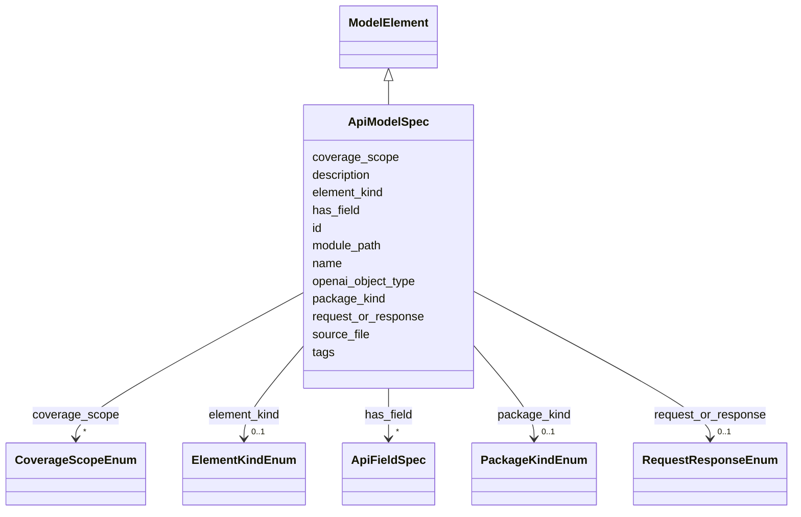

```mermaid
 classDiagram
    class ApiModelSpec
    click ApiModelSpec href "../ApiModelSpec"
      ModelElement <|-- ApiModelSpec
        click ModelElement href "../ModelElement"
      
      ApiModelSpec : coverage_scope
        
          
    
        
        
        ApiModelSpec --> "*" CoverageScopeEnum : coverage_scope
        click CoverageScopeEnum href "../CoverageScopeEnum"
    

        
      ApiModelSpec : description
        
      ApiModelSpec : element_kind
        
          
    
        
        
        ApiModelSpec --> "0..1" ElementKindEnum : element_kind
        click ElementKindEnum href "../ElementKindEnum"
    

        
      ApiModelSpec : has_field
        
          
    
        
        
        ApiModelSpec --> "*" ApiFieldSpec : has_field
        click ApiFieldSpec href "../ApiFieldSpec"
    

        
      ApiModelSpec : id
        
      ApiModelSpec : module_path
        
      ApiModelSpec : name
        
      ApiModelSpec : openai_object_type
        
      ApiModelSpec : package_kind
        
          
    
        
        
        ApiModelSpec --> "0..1" PackageKindEnum : package_kind
        click PackageKindEnum href "../PackageKindEnum"
    

        
      ApiModelSpec : request_or_response
        
          
    
        
        
        ApiModelSpec --> "0..1" RequestResponseEnum : request_or_response
        click RequestResponseEnum href "../RequestResponseEnum"
    

        
      ApiModelSpec : source_file
        
      ApiModelSpec : tags
        
      
```
