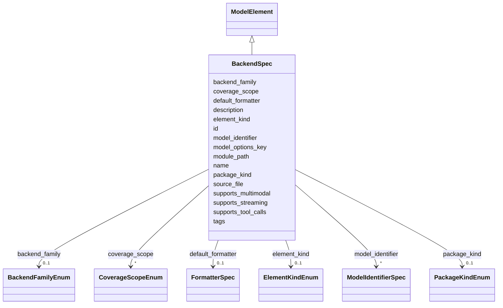

```mermaid
 classDiagram
    class BackendSpec
    click BackendSpec href "../BackendSpec"
      ModelElement <|-- BackendSpec
        click ModelElement href "../ModelElement"
      
      BackendSpec : backend_family
        
          
    
        
        
        BackendSpec --> "0..1" BackendFamilyEnum : backend_family
        click BackendFamilyEnum href "../BackendFamilyEnum"
    

        
      BackendSpec : coverage_scope
        
          
    
        
        
        BackendSpec --> "*" CoverageScopeEnum : coverage_scope
        click CoverageScopeEnum href "../CoverageScopeEnum"
    

        
      BackendSpec : default_formatter
        
          
    
        
        
        BackendSpec --> "0..1" FormatterSpec : default_formatter
        click FormatterSpec href "../FormatterSpec"
    

        
      BackendSpec : description
        
      BackendSpec : element_kind
        
          
    
        
        
        BackendSpec --> "0..1" ElementKindEnum : element_kind
        click ElementKindEnum href "../ElementKindEnum"
    

        
      BackendSpec : id
        
      BackendSpec : model_identifier
        
          
    
        
        
        BackendSpec --> "*" ModelIdentifierSpec : model_identifier
        click ModelIdentifierSpec href "../ModelIdentifierSpec"
    

        
      BackendSpec : model_options_key
        
      BackendSpec : module_path
        
      BackendSpec : name
        
      BackendSpec : package_kind
        
          
    
        
        
        BackendSpec --> "0..1" PackageKindEnum : package_kind
        click PackageKindEnum href "../PackageKindEnum"
    

        
      BackendSpec : source_file
        
      BackendSpec : supports_multimodal
        
      BackendSpec : supports_streaming
        
      BackendSpec : supports_tool_calls
        
      BackendSpec : tags
        
      
```
