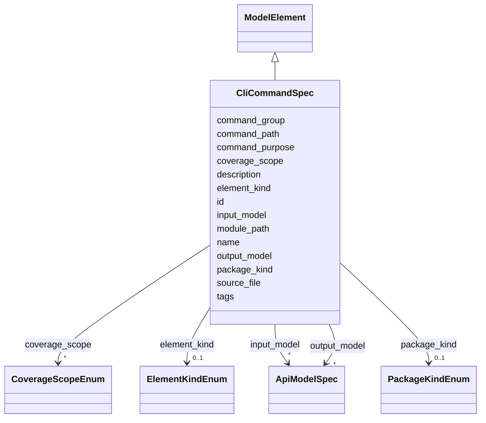

```mermaid
 classDiagram
    class CliCommandSpec
    click CliCommandSpec href "../CliCommandSpec"
      ModelElement <|-- CliCommandSpec
        click ModelElement href "../ModelElement"
      
      CliCommandSpec : command_group
        
      CliCommandSpec : command_path
        
      CliCommandSpec : command_purpose
        
      CliCommandSpec : coverage_scope
        
          
    
        
        
        CliCommandSpec --> "*" CoverageScopeEnum : coverage_scope
        click CoverageScopeEnum href "../CoverageScopeEnum"
    

        
      CliCommandSpec : description
        
      CliCommandSpec : element_kind
        
          
    
        
        
        CliCommandSpec --> "0..1" ElementKindEnum : element_kind
        click ElementKindEnum href "../ElementKindEnum"
    

        
      CliCommandSpec : id
        
      CliCommandSpec : input_model
        
          
    
        
        
        CliCommandSpec --> "*" ApiModelSpec : input_model
        click ApiModelSpec href "../ApiModelSpec"
    

        
      CliCommandSpec : module_path
        
      CliCommandSpec : name
        
      CliCommandSpec : output_model
        
          
    
        
        
        CliCommandSpec --> "*" ApiModelSpec : output_model
        click ApiModelSpec href "../ApiModelSpec"
    

        
      CliCommandSpec : package_kind
        
          
    
        
        
        CliCommandSpec --> "0..1" PackageKindEnum : package_kind
        click PackageKindEnum href "../PackageKindEnum"
    

        
      CliCommandSpec : source_file
        
      CliCommandSpec : tags
        
      
```
