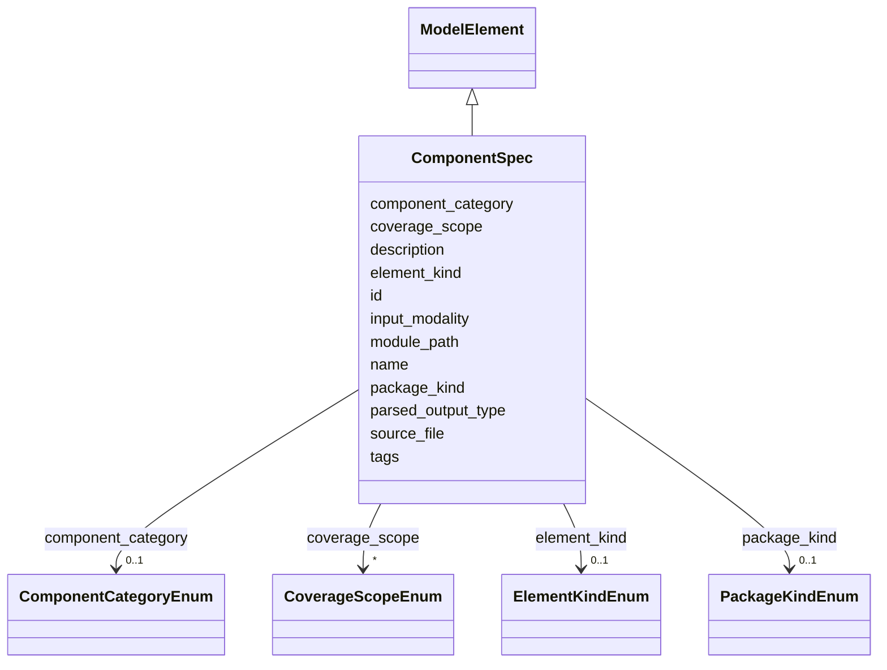

```mermaid
 classDiagram
    class ComponentSpec
    click ComponentSpec href "../ComponentSpec"
      ModelElement <|-- ComponentSpec
        click ModelElement href "../ModelElement"
      
      ComponentSpec : component_category
        
          
    
        
        
        ComponentSpec --> "0..1" ComponentCategoryEnum : component_category
        click ComponentCategoryEnum href "../ComponentCategoryEnum"
    

        
      ComponentSpec : coverage_scope
        
          
    
        
        
        ComponentSpec --> "*" CoverageScopeEnum : coverage_scope
        click CoverageScopeEnum href "../CoverageScopeEnum"
    

        
      ComponentSpec : description
        
      ComponentSpec : element_kind
        
          
    
        
        
        ComponentSpec --> "0..1" ElementKindEnum : element_kind
        click ElementKindEnum href "../ElementKindEnum"
    

        
      ComponentSpec : id
        
      ComponentSpec : input_modality
        
      ComponentSpec : module_path
        
      ComponentSpec : name
        
      ComponentSpec : package_kind
        
          
    
        
        
        ComponentSpec --> "0..1" PackageKindEnum : package_kind
        click PackageKindEnum href "../PackageKindEnum"
    

        
      ComponentSpec : parsed_output_type
        
      ComponentSpec : source_file
        
      ComponentSpec : tags
        
      
```
