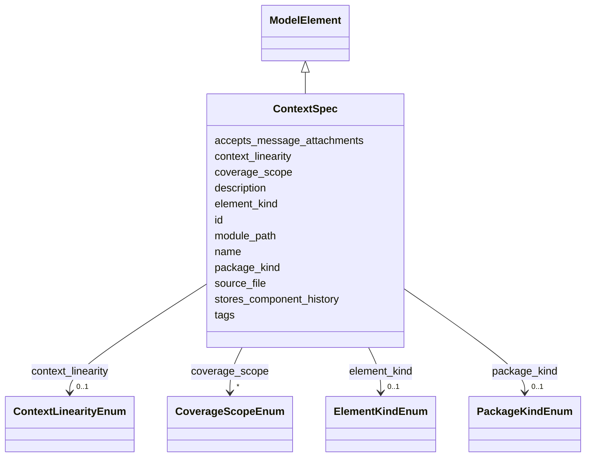

```mermaid
 classDiagram
    class ContextSpec
    click ContextSpec href "../ContextSpec"
      ModelElement <|-- ContextSpec
        click ModelElement href "../ModelElement"
      
      ContextSpec : accepts_message_attachments
        
      ContextSpec : context_linearity
        
          
    
        
        
        ContextSpec --> "0..1" ContextLinearityEnum : context_linearity
        click ContextLinearityEnum href "../ContextLinearityEnum"
    

        
      ContextSpec : coverage_scope
        
          
    
        
        
        ContextSpec --> "*" CoverageScopeEnum : coverage_scope
        click CoverageScopeEnum href "../CoverageScopeEnum"
    

        
      ContextSpec : description
        
      ContextSpec : element_kind
        
          
    
        
        
        ContextSpec --> "0..1" ElementKindEnum : element_kind
        click ElementKindEnum href "../ElementKindEnum"
    

        
      ContextSpec : id
        
      ContextSpec : module_path
        
      ContextSpec : name
        
      ContextSpec : package_kind
        
          
    
        
        
        ContextSpec --> "0..1" PackageKindEnum : package_kind
        click PackageKindEnum href "../PackageKindEnum"
    

        
      ContextSpec : source_file
        
      ContextSpec : stores_component_history
        
      ContextSpec : tags
        
      
```
