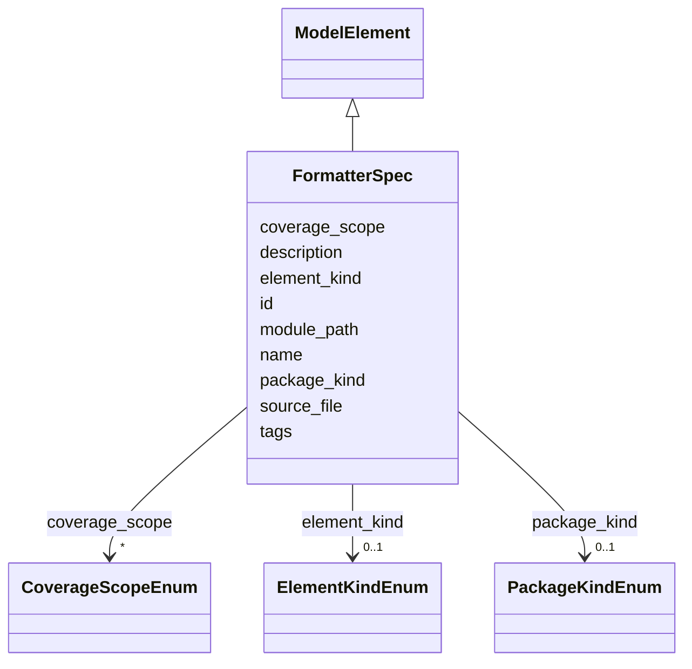

```mermaid
 classDiagram
    class FormatterSpec
    click FormatterSpec href "../FormatterSpec"
      ModelElement <|-- FormatterSpec
        click ModelElement href "../ModelElement"
      
      FormatterSpec : coverage_scope
        
          
    
        
        
        FormatterSpec --> "*" CoverageScopeEnum : coverage_scope
        click CoverageScopeEnum href "../CoverageScopeEnum"
    

        
      FormatterSpec : description
        
      FormatterSpec : element_kind
        
          
    
        
        
        FormatterSpec --> "0..1" ElementKindEnum : element_kind
        click ElementKindEnum href "../ElementKindEnum"
    

        
      FormatterSpec : id
        
      FormatterSpec : module_path
        
      FormatterSpec : name
        
      FormatterSpec : package_kind
        
          
    
        
        
        FormatterSpec --> "0..1" PackageKindEnum : package_kind
        click PackageKindEnum href "../PackageKindEnum"
    

        
      FormatterSpec : source_file
        
      FormatterSpec : tags
        
      
```
