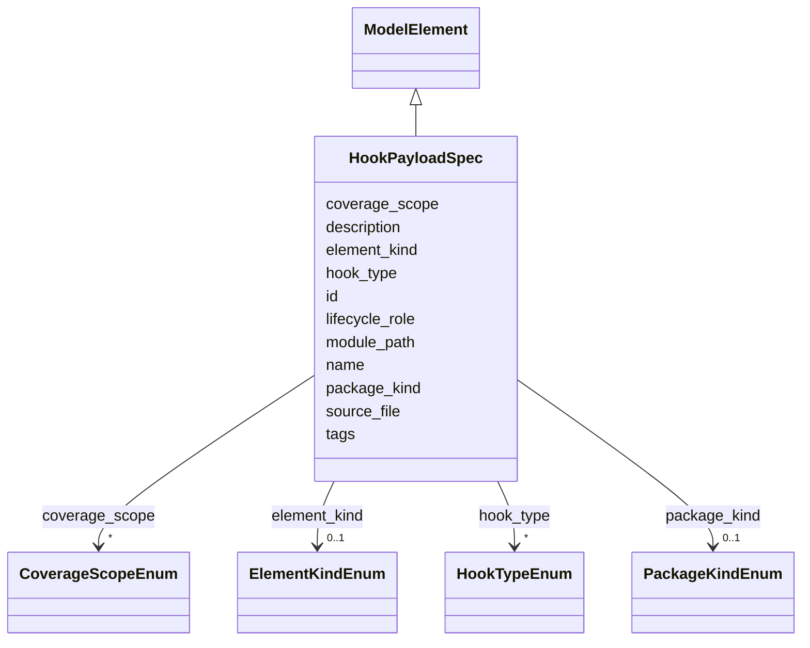

```mermaid
 classDiagram
    class HookPayloadSpec
    click HookPayloadSpec href "../HookPayloadSpec"
      ModelElement <|-- HookPayloadSpec
        click ModelElement href "../ModelElement"
      
      HookPayloadSpec : coverage_scope
        
          
    
        
        
        HookPayloadSpec --> "*" CoverageScopeEnum : coverage_scope
        click CoverageScopeEnum href "../CoverageScopeEnum"
    

        
      HookPayloadSpec : description
        
      HookPayloadSpec : element_kind
        
          
    
        
        
        HookPayloadSpec --> "0..1" ElementKindEnum : element_kind
        click ElementKindEnum href "../ElementKindEnum"
    

        
      HookPayloadSpec : hook_type
        
          
    
        
        
        HookPayloadSpec --> "*" HookTypeEnum : hook_type
        click HookTypeEnum href "../HookTypeEnum"
    

        
      HookPayloadSpec : id
        
      HookPayloadSpec : lifecycle_role
        
      HookPayloadSpec : module_path
        
      HookPayloadSpec : name
        
      HookPayloadSpec : package_kind
        
          
    
        
        
        HookPayloadSpec --> "0..1" PackageKindEnum : package_kind
        click PackageKindEnum href "../PackageKindEnum"
    

        
      HookPayloadSpec : source_file
        
      HookPayloadSpec : tags
        
      
```
