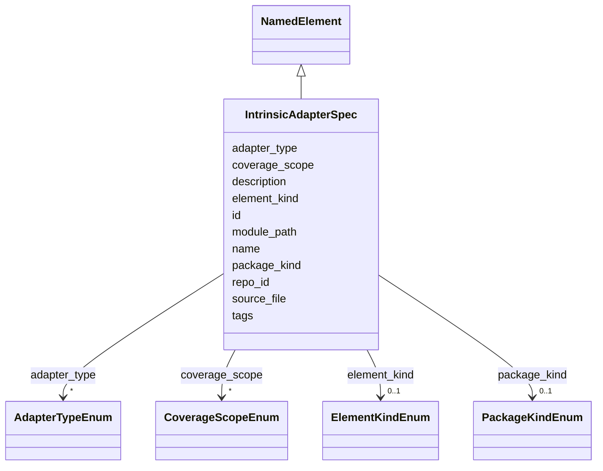

```mermaid
 classDiagram
    class IntrinsicAdapterSpec
    click IntrinsicAdapterSpec href "../IntrinsicAdapterSpec"
      NamedElement <|-- IntrinsicAdapterSpec
        click NamedElement href "../NamedElement"
      
      IntrinsicAdapterSpec : adapter_type
        
          
    
        
        
        IntrinsicAdapterSpec --> "*" AdapterTypeEnum : adapter_type
        click AdapterTypeEnum href "../AdapterTypeEnum"
    

        
      IntrinsicAdapterSpec : coverage_scope
        
          
    
        
        
        IntrinsicAdapterSpec --> "*" CoverageScopeEnum : coverage_scope
        click CoverageScopeEnum href "../CoverageScopeEnum"
    

        
      IntrinsicAdapterSpec : description
        
      IntrinsicAdapterSpec : element_kind
        
          
    
        
        
        IntrinsicAdapterSpec --> "0..1" ElementKindEnum : element_kind
        click ElementKindEnum href "../ElementKindEnum"
    

        
      IntrinsicAdapterSpec : id
        
      IntrinsicAdapterSpec : module_path
        
      IntrinsicAdapterSpec : name
        
      IntrinsicAdapterSpec : package_kind
        
          
    
        
        
        IntrinsicAdapterSpec --> "0..1" PackageKindEnum : package_kind
        click PackageKindEnum href "../PackageKindEnum"
    

        
      IntrinsicAdapterSpec : repo_id
        
      IntrinsicAdapterSpec : source_file
        
      IntrinsicAdapterSpec : tags
        
      
```
