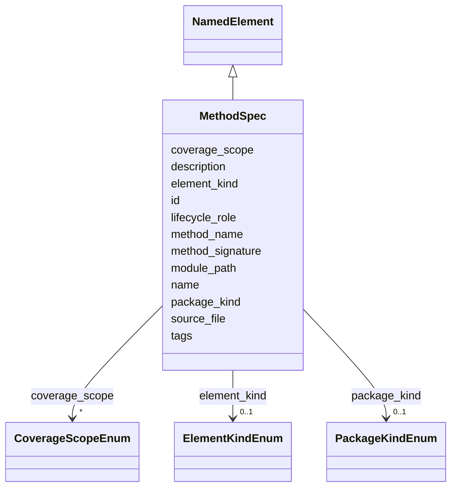

```mermaid
 classDiagram
    class MethodSpec
    click MethodSpec href "../MethodSpec"
      NamedElement <|-- MethodSpec
        click NamedElement href "../NamedElement"
      
      MethodSpec : coverage_scope
        
          
    
        
        
        MethodSpec --> "*" CoverageScopeEnum : coverage_scope
        click CoverageScopeEnum href "../CoverageScopeEnum"
    

        
      MethodSpec : description
        
      MethodSpec : element_kind
        
          
    
        
        
        MethodSpec --> "0..1" ElementKindEnum : element_kind
        click ElementKindEnum href "../ElementKindEnum"
    

        
      MethodSpec : id
        
      MethodSpec : lifecycle_role
        
      MethodSpec : method_name
        
      MethodSpec : method_signature
        
      MethodSpec : module_path
        
      MethodSpec : name
        
      MethodSpec : package_kind
        
          
    
        
        
        MethodSpec --> "0..1" PackageKindEnum : package_kind
        click PackageKindEnum href "../PackageKindEnum"
    

        
      MethodSpec : source_file
        
      MethodSpec : tags
        
      
```
