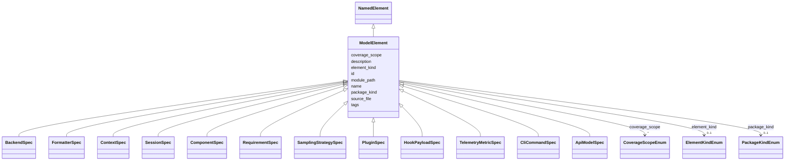

```mermaid
 classDiagram
    class ModelElement
    click ModelElement href "../ModelElement"
      NamedElement <|-- ModelElement
        click NamedElement href "../NamedElement"
      

      ModelElement <|-- BackendSpec
        click BackendSpec href "../BackendSpec"
      ModelElement <|-- FormatterSpec
        click FormatterSpec href "../FormatterSpec"
      ModelElement <|-- ContextSpec
        click ContextSpec href "../ContextSpec"
      ModelElement <|-- SessionSpec
        click SessionSpec href "../SessionSpec"
      ModelElement <|-- ComponentSpec
        click ComponentSpec href "../ComponentSpec"
      ModelElement <|-- RequirementSpec
        click RequirementSpec href "../RequirementSpec"
      ModelElement <|-- SamplingStrategySpec
        click SamplingStrategySpec href "../SamplingStrategySpec"
      ModelElement <|-- PluginSpec
        click PluginSpec href "../PluginSpec"
      ModelElement <|-- HookPayloadSpec
        click HookPayloadSpec href "../HookPayloadSpec"
      ModelElement <|-- TelemetryMetricSpec
        click TelemetryMetricSpec href "../TelemetryMetricSpec"
      ModelElement <|-- CliCommandSpec
        click CliCommandSpec href "../CliCommandSpec"
      ModelElement <|-- ApiModelSpec
        click ApiModelSpec href "../ApiModelSpec"
      

      ModelElement : coverage_scope
        
          
    
        
        
        ModelElement --> "*" CoverageScopeEnum : coverage_scope
        click CoverageScopeEnum href "../CoverageScopeEnum"
    

        
      ModelElement : description
        
      ModelElement : element_kind
        
          
    
        
        
        ModelElement --> "0..1" ElementKindEnum : element_kind
        click ElementKindEnum href "../ElementKindEnum"
    

        
      ModelElement : id
        
      ModelElement : module_path
        
      ModelElement : name
        
      ModelElement : package_kind
        
          
    
        
        
        ModelElement --> "0..1" PackageKindEnum : package_kind
        click PackageKindEnum href "../PackageKindEnum"
    

        
      ModelElement : source_file
        
      ModelElement : tags
        
      
```
