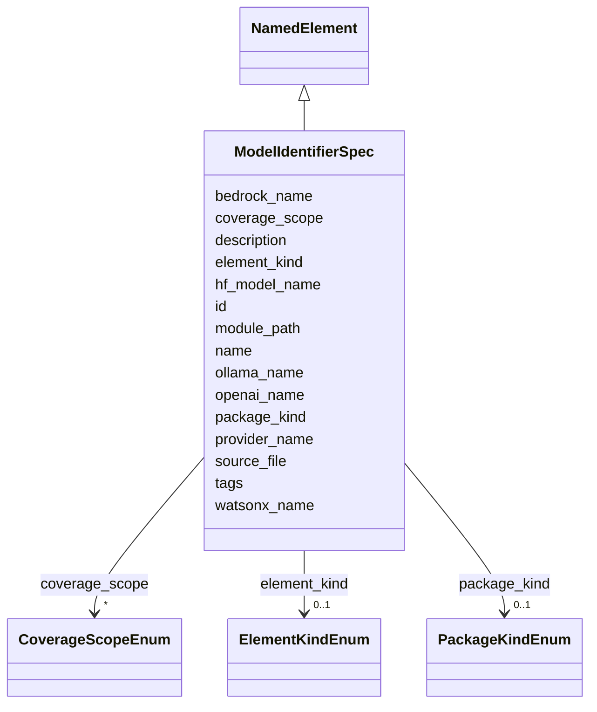

```mermaid
 classDiagram
    class ModelIdentifierSpec
    click ModelIdentifierSpec href "../ModelIdentifierSpec"
      NamedElement <|-- ModelIdentifierSpec
        click NamedElement href "../NamedElement"
      
      ModelIdentifierSpec : bedrock_name
        
      ModelIdentifierSpec : coverage_scope
        
          
    
        
        
        ModelIdentifierSpec --> "*" CoverageScopeEnum : coverage_scope
        click CoverageScopeEnum href "../CoverageScopeEnum"
    

        
      ModelIdentifierSpec : description
        
      ModelIdentifierSpec : element_kind
        
          
    
        
        
        ModelIdentifierSpec --> "0..1" ElementKindEnum : element_kind
        click ElementKindEnum href "../ElementKindEnum"
    

        
      ModelIdentifierSpec : hf_model_name
        
      ModelIdentifierSpec : id
        
      ModelIdentifierSpec : module_path
        
      ModelIdentifierSpec : name
        
      ModelIdentifierSpec : ollama_name
        
      ModelIdentifierSpec : openai_name
        
      ModelIdentifierSpec : package_kind
        
          
    
        
        
        ModelIdentifierSpec --> "0..1" PackageKindEnum : package_kind
        click PackageKindEnum href "../PackageKindEnum"
    

        
      ModelIdentifierSpec : provider_name
        
      ModelIdentifierSpec : source_file
        
      ModelIdentifierSpec : tags
        
      ModelIdentifierSpec : watsonx_name
        
      
```
