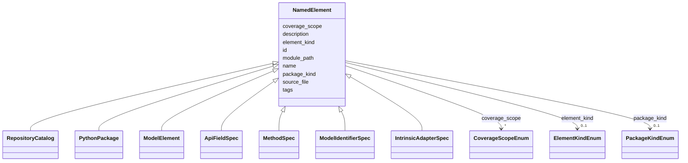

```mermaid
 classDiagram
    class NamedElement
    click NamedElement href "../NamedElement"
      NamedElement <|-- RepositoryCatalog
        click RepositoryCatalog href "../RepositoryCatalog"
      NamedElement <|-- PythonPackage
        click PythonPackage href "../PythonPackage"
      NamedElement <|-- ModelElement
        click ModelElement href "../ModelElement"
      NamedElement <|-- ApiFieldSpec
        click ApiFieldSpec href "../ApiFieldSpec"
      NamedElement <|-- MethodSpec
        click MethodSpec href "../MethodSpec"
      NamedElement <|-- ModelIdentifierSpec
        click ModelIdentifierSpec href "../ModelIdentifierSpec"
      NamedElement <|-- IntrinsicAdapterSpec
        click IntrinsicAdapterSpec href "../IntrinsicAdapterSpec"
      
      NamedElement : coverage_scope
        
          
    
        
        
        NamedElement --> "*" CoverageScopeEnum : coverage_scope
        click CoverageScopeEnum href "../CoverageScopeEnum"
    

        
      NamedElement : description
        
      NamedElement : element_kind
        
          
    
        
        
        NamedElement --> "0..1" ElementKindEnum : element_kind
        click ElementKindEnum href "../ElementKindEnum"
    

        
      NamedElement : id
        
      NamedElement : module_path
        
      NamedElement : name
        
      NamedElement : package_kind
        
          
    
        
        
        NamedElement --> "0..1" PackageKindEnum : package_kind
        click PackageKindEnum href "../PackageKindEnum"
    

        
      NamedElement : source_file
        
      NamedElement : tags
        
      
```
