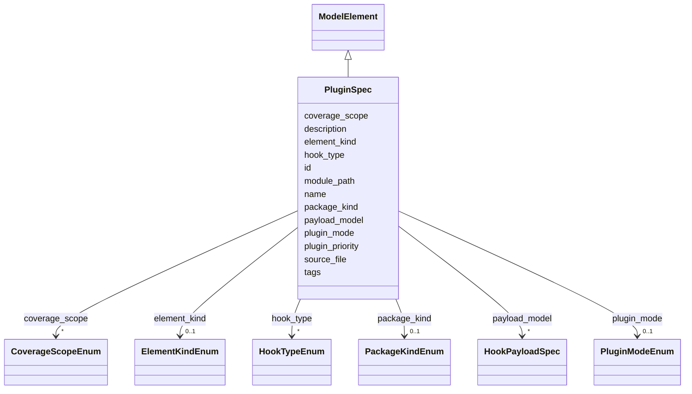

```mermaid
 classDiagram
    class PluginSpec
    click PluginSpec href "../PluginSpec"
      ModelElement <|-- PluginSpec
        click ModelElement href "../ModelElement"
      
      PluginSpec : coverage_scope
        
          
    
        
        
        PluginSpec --> "*" CoverageScopeEnum : coverage_scope
        click CoverageScopeEnum href "../CoverageScopeEnum"
    

        
      PluginSpec : description
        
      PluginSpec : element_kind
        
          
    
        
        
        PluginSpec --> "0..1" ElementKindEnum : element_kind
        click ElementKindEnum href "../ElementKindEnum"
    

        
      PluginSpec : hook_type
        
          
    
        
        
        PluginSpec --> "*" HookTypeEnum : hook_type
        click HookTypeEnum href "../HookTypeEnum"
    

        
      PluginSpec : id
        
      PluginSpec : module_path
        
      PluginSpec : name
        
      PluginSpec : package_kind
        
          
    
        
        
        PluginSpec --> "0..1" PackageKindEnum : package_kind
        click PackageKindEnum href "../PackageKindEnum"
    

        
      PluginSpec : payload_model
        
          
    
        
        
        PluginSpec --> "*" HookPayloadSpec : payload_model
        click HookPayloadSpec href "../HookPayloadSpec"
    

        
      PluginSpec : plugin_mode
        
          
    
        
        
        PluginSpec --> "0..1" PluginModeEnum : plugin_mode
        click PluginModeEnum href "../PluginModeEnum"
    

        
      PluginSpec : plugin_priority
        
      PluginSpec : source_file
        
      PluginSpec : tags
        
      
```
