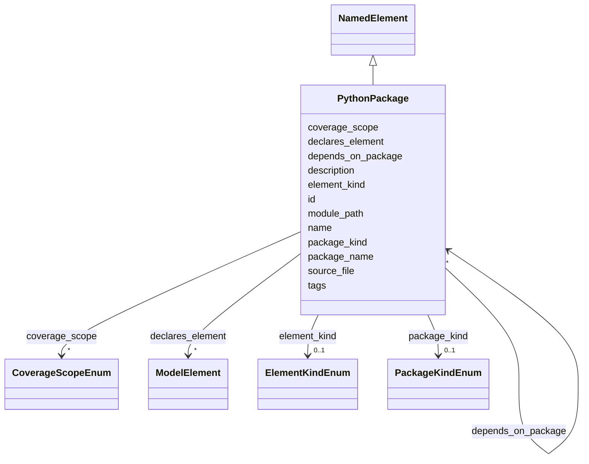

```mermaid
 classDiagram
    class PythonPackage
    click PythonPackage href "../PythonPackage"
      NamedElement <|-- PythonPackage
        click NamedElement href "../NamedElement"
      
      PythonPackage : coverage_scope
        
          
    
        
        
        PythonPackage --> "*" CoverageScopeEnum : coverage_scope
        click CoverageScopeEnum href "../CoverageScopeEnum"
    

        
      PythonPackage : declares_element
        
          
    
        
        
        PythonPackage --> "*" ModelElement : declares_element
        click ModelElement href "../ModelElement"
    

        
      PythonPackage : depends_on_package
        
          
    
        
        
        PythonPackage --> "*" PythonPackage : depends_on_package
        click PythonPackage href "../PythonPackage"
    

        
      PythonPackage : description
        
      PythonPackage : element_kind
        
          
    
        
        
        PythonPackage --> "0..1" ElementKindEnum : element_kind
        click ElementKindEnum href "../ElementKindEnum"
    

        
      PythonPackage : id
        
      PythonPackage : module_path
        
      PythonPackage : name
        
      PythonPackage : package_kind
        
          
    
        
        
        PythonPackage --> "0..1" PackageKindEnum : package_kind
        click PackageKindEnum href "../PackageKindEnum"
    

        
      PythonPackage : package_name
        
      PythonPackage : source_file
        
      PythonPackage : tags
        
      
```
