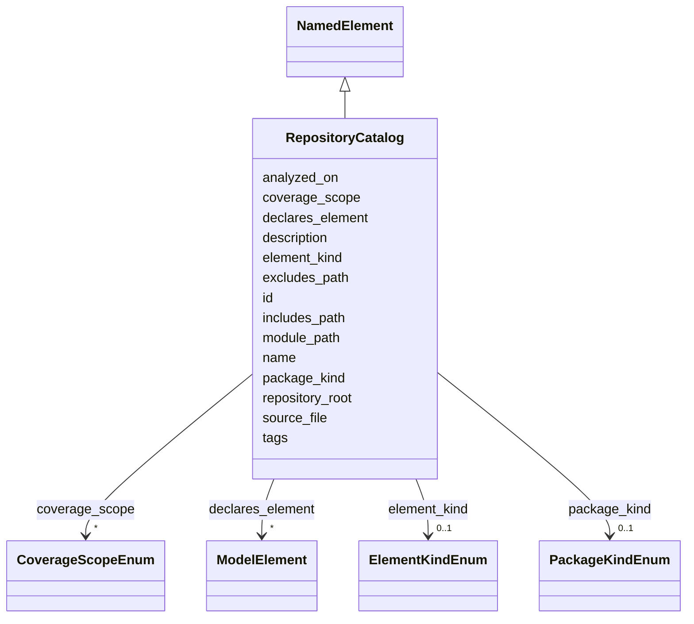

```mermaid
 classDiagram
    class RepositoryCatalog
    click RepositoryCatalog href "../RepositoryCatalog"
      NamedElement <|-- RepositoryCatalog
        click NamedElement href "../NamedElement"
      
      RepositoryCatalog : analyzed_on
        
      RepositoryCatalog : coverage_scope
        
          
    
        
        
        RepositoryCatalog --> "*" CoverageScopeEnum : coverage_scope
        click CoverageScopeEnum href "../CoverageScopeEnum"
    

        
      RepositoryCatalog : declares_element
        
          
    
        
        
        RepositoryCatalog --> "*" ModelElement : declares_element
        click ModelElement href "../ModelElement"
    

        
      RepositoryCatalog : description
        
      RepositoryCatalog : element_kind
        
          
    
        
        
        RepositoryCatalog --> "0..1" ElementKindEnum : element_kind
        click ElementKindEnum href "../ElementKindEnum"
    

        
      RepositoryCatalog : excludes_path
        
      RepositoryCatalog : id
        
      RepositoryCatalog : includes_path
        
      RepositoryCatalog : module_path
        
      RepositoryCatalog : name
        
      RepositoryCatalog : package_kind
        
          
    
        
        
        RepositoryCatalog --> "0..1" PackageKindEnum : package_kind
        click PackageKindEnum href "../PackageKindEnum"
    

        
      RepositoryCatalog : repository_root
        
      RepositoryCatalog : source_file
        
      RepositoryCatalog : tags
        
      
```
