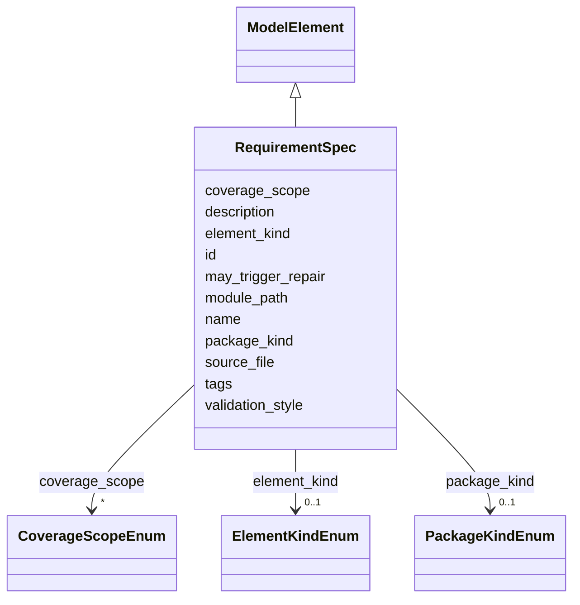

```mermaid
 classDiagram
    class RequirementSpec
    click RequirementSpec href "../RequirementSpec"
      ModelElement <|-- RequirementSpec
        click ModelElement href "../ModelElement"
      
      RequirementSpec : coverage_scope
        
          
    
        
        
        RequirementSpec --> "*" CoverageScopeEnum : coverage_scope
        click CoverageScopeEnum href "../CoverageScopeEnum"
    

        
      RequirementSpec : description
        
      RequirementSpec : element_kind
        
          
    
        
        
        RequirementSpec --> "0..1" ElementKindEnum : element_kind
        click ElementKindEnum href "../ElementKindEnum"
    

        
      RequirementSpec : id
        
      RequirementSpec : may_trigger_repair
        
      RequirementSpec : module_path
        
      RequirementSpec : name
        
      RequirementSpec : package_kind
        
          
    
        
        
        RequirementSpec --> "0..1" PackageKindEnum : package_kind
        click PackageKindEnum href "../PackageKindEnum"
    

        
      RequirementSpec : source_file
        
      RequirementSpec : tags
        
      RequirementSpec : validation_style
        
      
```
