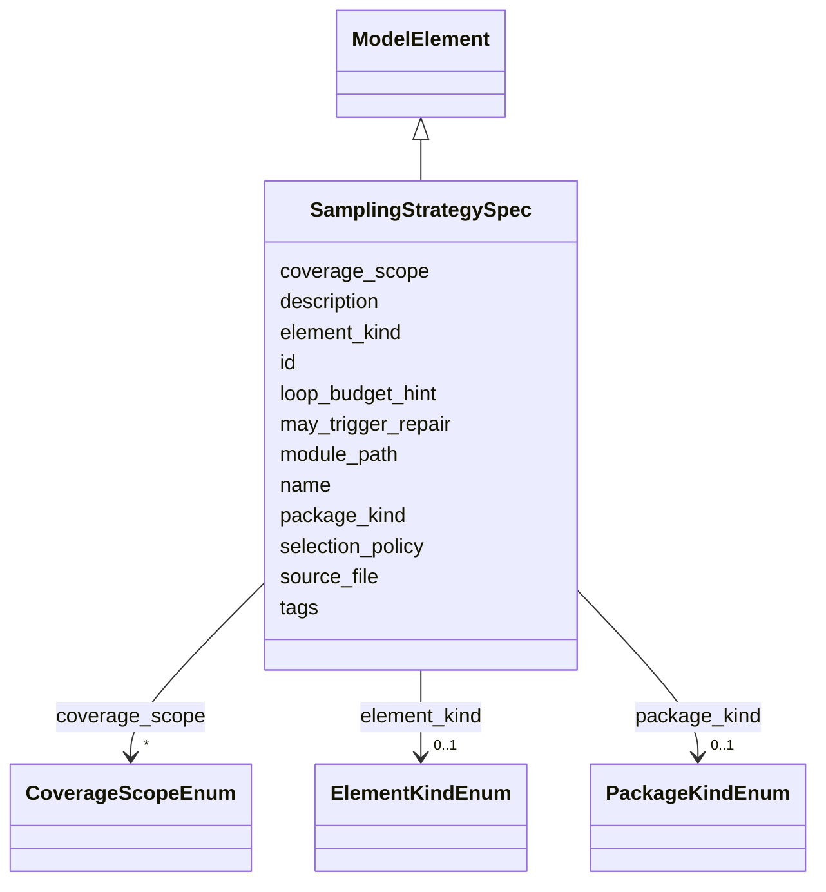

```mermaid
 classDiagram
    class SamplingStrategySpec
    click SamplingStrategySpec href "../SamplingStrategySpec"
      ModelElement <|-- SamplingStrategySpec
        click ModelElement href "../ModelElement"
      
      SamplingStrategySpec : coverage_scope
        
          
    
        
        
        SamplingStrategySpec --> "*" CoverageScopeEnum : coverage_scope
        click CoverageScopeEnum href "../CoverageScopeEnum"
    

        
      SamplingStrategySpec : description
        
      SamplingStrategySpec : element_kind
        
          
    
        
        
        SamplingStrategySpec --> "0..1" ElementKindEnum : element_kind
        click ElementKindEnum href "../ElementKindEnum"
    

        
      SamplingStrategySpec : id
        
      SamplingStrategySpec : loop_budget_hint
        
      SamplingStrategySpec : may_trigger_repair
        
      SamplingStrategySpec : module_path
        
      SamplingStrategySpec : name
        
      SamplingStrategySpec : package_kind
        
          
    
        
        
        SamplingStrategySpec --> "0..1" PackageKindEnum : package_kind
        click PackageKindEnum href "../PackageKindEnum"
    

        
      SamplingStrategySpec : selection_policy
        
      SamplingStrategySpec : source_file
        
      SamplingStrategySpec : tags
        
      
```
