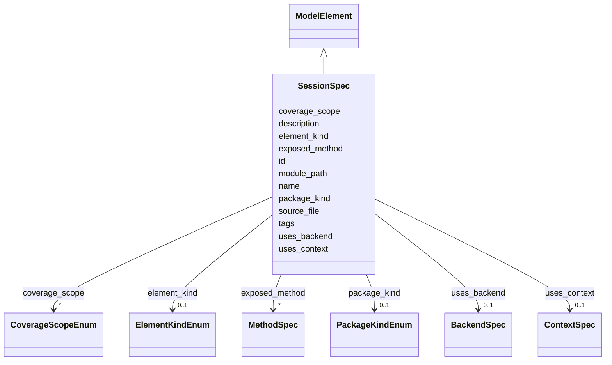

```mermaid
 classDiagram
    class SessionSpec
    click SessionSpec href "../SessionSpec"
      ModelElement <|-- SessionSpec
        click ModelElement href "../ModelElement"
      
      SessionSpec : coverage_scope
        
          
    
        
        
        SessionSpec --> "*" CoverageScopeEnum : coverage_scope
        click CoverageScopeEnum href "../CoverageScopeEnum"
    

        
      SessionSpec : description
        
      SessionSpec : element_kind
        
          
    
        
        
        SessionSpec --> "0..1" ElementKindEnum : element_kind
        click ElementKindEnum href "../ElementKindEnum"
    

        
      SessionSpec : exposed_method
        
          
    
        
        
        SessionSpec --> "*" MethodSpec : exposed_method
        click MethodSpec href "../MethodSpec"
    

        
      SessionSpec : id
        
      SessionSpec : module_path
        
      SessionSpec : name
        
      SessionSpec : package_kind
        
          
    
        
        
        SessionSpec --> "0..1" PackageKindEnum : package_kind
        click PackageKindEnum href "../PackageKindEnum"
    

        
      SessionSpec : source_file
        
      SessionSpec : tags
        
      SessionSpec : uses_backend
        
          
    
        
        
        SessionSpec --> "0..1" BackendSpec : uses_backend
        click BackendSpec href "../BackendSpec"
    

        
      SessionSpec : uses_context
        
          
    
        
        
        SessionSpec --> "0..1" ContextSpec : uses_context
        click ContextSpec href "../ContextSpec"
    

        
      
```
