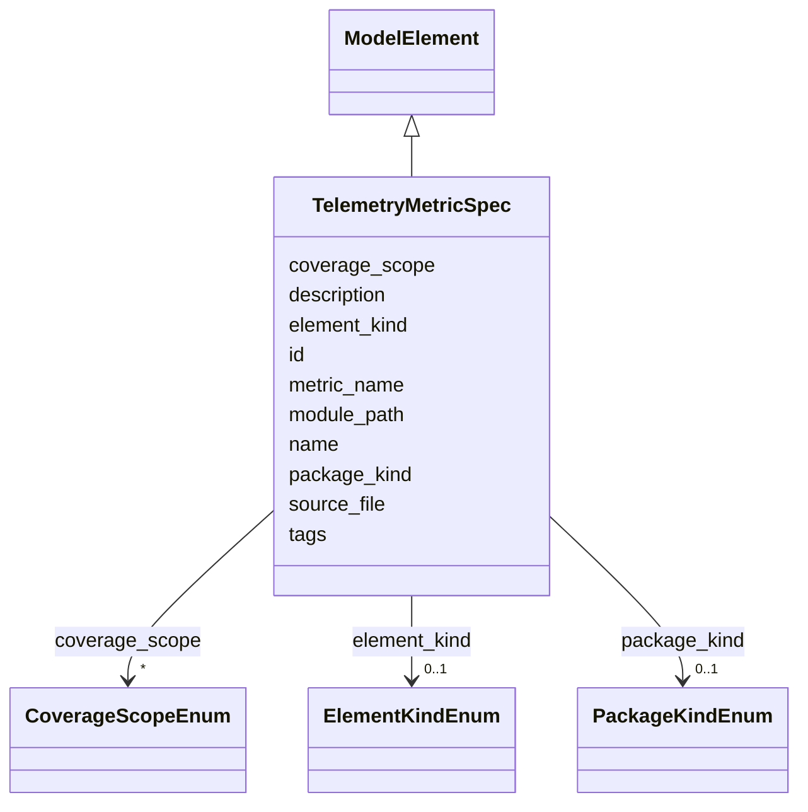

```mermaid
 classDiagram
    class TelemetryMetricSpec
    click TelemetryMetricSpec href "../TelemetryMetricSpec"
      ModelElement <|-- TelemetryMetricSpec
        click ModelElement href "../ModelElement"
      
      TelemetryMetricSpec : coverage_scope
        
          
    
        
        
        TelemetryMetricSpec --> "*" CoverageScopeEnum : coverage_scope
        click CoverageScopeEnum href "../CoverageScopeEnum"
    

        
      TelemetryMetricSpec : description
        
      TelemetryMetricSpec : element_kind
        
          
    
        
        
        TelemetryMetricSpec --> "0..1" ElementKindEnum : element_kind
        click ElementKindEnum href "../ElementKindEnum"
    

        
      TelemetryMetricSpec : id
        
      TelemetryMetricSpec : metric_name
        
      TelemetryMetricSpec : module_path
        
      TelemetryMetricSpec : name
        
      TelemetryMetricSpec : package_kind
        
          
    
        
        
        TelemetryMetricSpec --> "0..1" PackageKindEnum : package_kind
        click PackageKindEnum href "../PackageKindEnum"
    

        
      TelemetryMetricSpec : source_file
        
      TelemetryMetricSpec : tags
        
      
```
